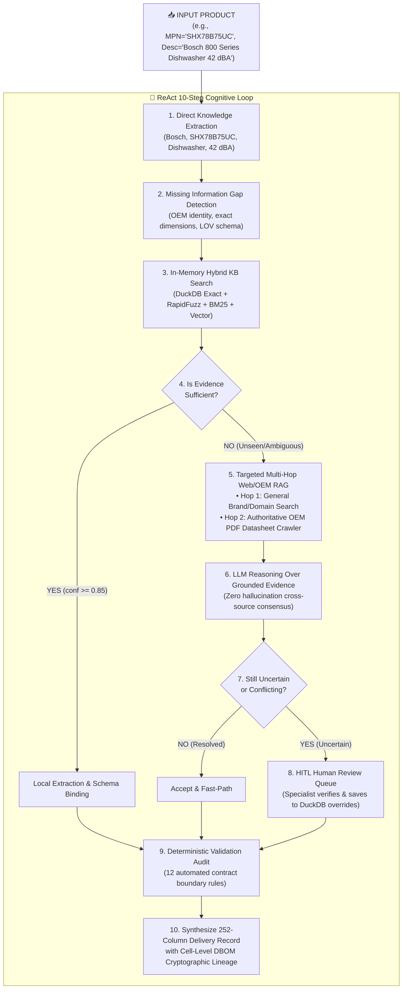
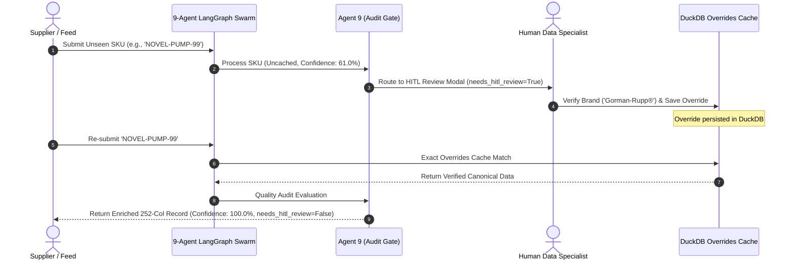
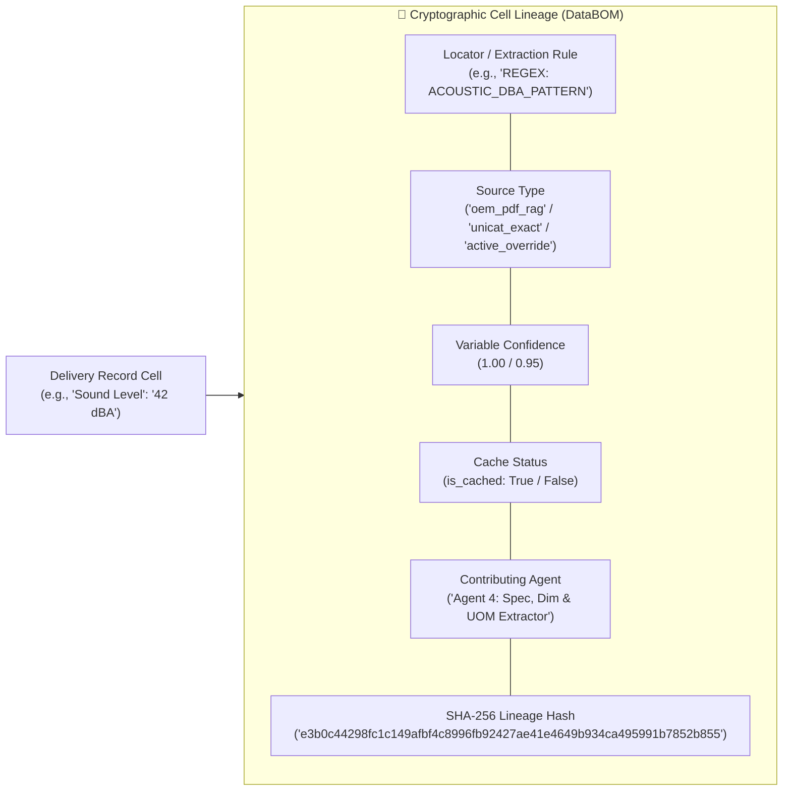
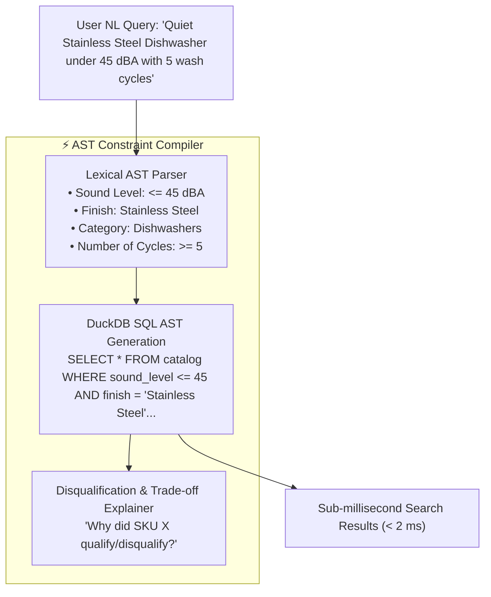

# ⚡ OmniSpec AI — Industrial Product Intelligence Platform

<p align="center">
  
  
  
  
  
  
</p>

> **Tagline:** *"From Cryptic Raw Part Rows to 252-Column Commerce-Ready Master Truth."*  
> **Challenge Track:** AI-Powered Product Intelligence for Industrial Commerce (Unilog / UniHack Hackathon Challenge).

---

## 📑 Quick Navigation & Documentation Index

- [🎯 Problem Statement & Industrial Context](#-problem-statement--industrial-context)
- [🧠 ReAct Cognitive Brain & Multi-Hop Architecture](#-react-cognitive-brain--multi-hop-architecture)
- [🏛️ 9-Agent Swarm Topology & Interactive Architecture Index](#️-9-agent-swarm-topology--interactive-architecture-index)
- [📊 Evidence-Aware 5-Pillar Confidence Engine](#-evidence-aware-5-pillar-confidence-engine)
- [⚡ Variable-Level Caching & Active Learning Loop](#-variable-level-caching--active-learning-loop)
- [🔬 Cryptographic Data Bill of Materials (DBOM) & Lineage](#-cryptographic-data-bill-of-materials-dbom--lineage)
- [🔍 Parametric Search AST Compiler & Compatibility Engine](#-parametric-search-ast-compiler--compatibility-engine)
- [💻 Complete Tech Stack](#-complete-tech-stack)
- [📁 Repository Structure](#-repository-structure)
- [🚀 Quickstart & Batch Evaluation](#-quickstart--batch-evaluation)
- [🧪 Automated Testing & Verification Suite](#-automated-testing--verification-suite)
- [✨ Multi-View Web Studio Workbenches](#-multi-view-web-studio-workbenches)
- [📚 Solution Documentation & Benchmark Artifacts](#-solution-documentation--benchmark-artifacts)

---

## 🎯 Problem Statement & Industrial Context

### The Core Industrial Commerce Challenge
Industrial distributors and manufacturers manage millions of SKUs across technical catalogs, PDF datasheets, distributor feeds, and legacy ERP systems. Raw product data handed over by distributors is rarely e-commerce ready:
- **Cryptic & Abbreviated Strings:** Short, unstructured descriptions like `"3/8 CPLG BRS 150#"` or `"4-1/2X.045X7/8 MTL CUT-OFF DISC"`.
- **Missing & Dummy Entities:** Crucial brand fields filled with placeholders like `"-- Unbranded --"`, `"-- No DIB Brand --"`, or vendor codes (`APPDE`, `BOICA`, `JAMIN`).
- **Inconsistent Units & Formats:** Non-standard units (`24in` vs `24 in`), decimals where tradespeople search fractions (`0.5 in` vs `1/2 in`), and conflicting dimension order.
- **Strict Compliance Governance:** Industrial e-commerce buyers need exact 252-column structured delivery schemas, strict character limits (`INVOICE_DESC` $\le 40$ chars ALL CAPS, `MOBILE_DESC` $60\text{--}80$ chars), legal brand casing with registered marks (`®`, `™`), and 100% zero-hallucination sourcing.

### OmniSpec AI's Solution
OmniSpec AI is an **autonomous, 9-agent LangGraph Swarm** orchestrated by a central **ReAct Cognitive Brain**, backed by an in-memory **DuckDB Knowledge Engine** (27,000+ legal UniCat brands, 161,000 controlled LOVs, 63 fractional lookup tables) and **Corrective RAG (CRAG) with live Web & OEM PDF Datasheet discovery**. It expands a raw supplier row into a fully validated, **252-column commerce-ready delivery record** with cell-level cryptographic provenance and zero hallucinations.

---

## 🧠 ReAct Cognitive Brain & Multi-Hop Architecture

The **ReAct Master Brain** (`backend/app/orchestrator/react_orchestrator.py`) acts as the central cognitive orchestrator. It does not blindly query external search engines for every item; rather, it reasons iteratively over evidence:



### Dedicated ReAct Tool Registry
The brain is equipped with 7 modular domain tools:
1. `tool_kb_hybrid_retrieval`: DuckDB exact + RapidFuzz + BM25 + vector search over 27K brands & overrides.
2. `tool_web_search_general`: First-hop DuckDuckGo search for brand/category identity (consumer marketplaces blocked).
3. `tool_datasheet_pdf_search`: Second-hop targeted crawler for OEM technical PDF datasheets (`.pdf`).
4. `tool_extract_specs_and_uoms`: Deterministic numerical & dimension parser (`LxWxH`, `V`, `A`, `W`, `dBA`, `PSI`, `RPM`, `GPM`, `AWG`).
5. `tool_bind_lov_schema`: Category LOV schema binder formatting up to 50 attribute triples (150 columns).
6. `tool_synthesize_unilog_copy`: Strict character-bounded copy generator (`INVOICE_DESC` $\le 40$ chars ALL CAPS, `MOBILE_DESC` $60\text{--}80$ chars).
7. `tool_generate_digital_assets`: Standardized asset namer (`<CleanBrand>_<MPN>.jpg` & `.pdf`).

---

## 🏛️ 9-Agent Swarm Topology & Interactive Architecture Index

```
+-------------------------------------------------------------------------------------------------------------------------------+
|                                            OMNISPEC AI 9-AGENT SWARM TOPOLOGY                                                  |
|                                                                                                                               |
|  [Raw Catalog Row]                                                                                                            |
|         │                                                                                                                     |
|         ▼                                                                                                                     |
|  ┌──────────────┐      ┌──────────────┐      ┌──────────────┐      ┌──────────────┐      ┌──────────────┐                     |
|  │   AGENT 1    │ ───► │   AGENT 2    │ ───► │   AGENT 3    │ ───► │   AGENT 4    │ ───► │   AGENT 5    │                     |
|  │  Ingestion & │      │    Entity    │      │  Taxonomy &  │      │ Spec, Dim &  │      │ OEM Sourcing │                     |
|  │ De-Noising   │      │  Resolution  │      │ Classification│     │  UOM Parser  │      │  & CRAG RAG  │                     |
|  └──────────────┘      └──────────────┘      └──────────────┘      └──────────────┘      └──────────────┘                     |
|                                                                                                  │                            |
|                                                                                                  ▼                            |
|  ┌──────────────┐      ┌──────────────┐      ┌──────────────┐      ┌──────────────┐      ┌──────────────┐                     |
|  │ Final Output │ ◄─── │   AGENT 9    │ ◄─── │   AGENT 8    │ ◄─── │   AGENT 7    │ ◄─── │   AGENT 6    │                     |
|  │ (252 Columns)│      │Quality, Audit│      │Digital Asset │      │ Multi-Channel│      │ Constrained  │                     |
|  │ & Analytics  │      │    & HITL    │      │ Synthesizer  │      │ Copy Builder │      │  LOV Mapper  │                     |
|  └──────────────┘      └──────────────┘      └──────────────┘      └──────────────┘      └──────────────┘                     |
+-------------------------------------------------------------------------------------------------------------------------------+
```

### 📑 Complete Agent Architecture Deep-Dive Blueprint Links

| # | Agent Name | Dedicated Architectural Specification | Primary Mission & Core Innovations | Key Deliverables |
| :-: | :--- | :--- | :--- | :--- |
| **1** | **Ingestion & De-Noising** | 📥 [**Agent 1 Architecture Blueprint**](Solution/agents/README_Agent_1_Ingestion_Tokenization.md) | Cleans raw input, strips placeholders (`-- Unbranded --`), tokenizes dimensions, DuckDB slang thesaurus (`sawzall`, `romex`). | Cleaned MPN, de-noised `Part_Desc`, token bag, row hash. |
| **2** | **Brand & Entity Resolution** | 🏷️ [**Agent 2 Architecture Blueprint**](Solution/agents/README_Agent_2_Entity_Resolution.md) | Checks active reviewer overrides, resolves supplier names to canonical 27K UniCat brands with registered marks (`®`, `™`), live DDGS web search. | `MANUFACTURER_NAME`, `BRAND_NAME`, `TRADE_NAME`, `®`/`™`. |
| **3** | **Taxonomy & Classification** | 🌲 [**Agent 3 Architecture Blueprint**](Solution/agents/README_Agent_3_Taxonomy_Classification.md) | Classifies SKU into 4-tier Classpath and assigns 8-digit leaf UNSPSC commodity code. | `Classpath`, `UNSPSC`, `Dept`, `Class`, `Fine`, `Product Name`. |
| **4** | **Spec, Dim & UOM Parser** | 📐 [**Agent 4 Architecture Blueprint**](Solution/agents/README_Agent_4_Spec_UOM_Extractor.md) | Extracts physical dimensions, electrical specs, converts to 63 exact fractions (`50.25 in` $\rightarrow$ `50-1/4 in`), Master UOM single spacing. | `LENGTH`, `WIDTH`, `HEIGHT`, `WEIGHT`, normalized UOMs, electrical specs. |
| **5** | **OEM Sourcing & CRAG RAG** | 🌐 [**Agent 5 Architecture Blueprint**](Solution/agents/README_Agent_5_OEM_Sourcing_RAG.md) | Discovers official OEM URLs, blocks marketplaces (0%), ingests PDF technical datasheets, Corrective RAG (CRAG). | `MFR URL`, `Ref URL 1..5`, PDF datasheet link, certs. |
| **6** | **Constrained LOV Mapper** | 🗄️ [**Agent 6 Architecture Blueprint**](Solution/agents/README_Agent_6_Constrained_LOV_Mapper.md) | Binds raw specs to 161,000-row UniCat LOV schema across 50 triples (150 columns). | `ATTRIBUTE_LABEL 1..50`, `ATTRIBUTE_VALUE 1..50`, `ATTRIBUTE_UOM 1..50`. |
| **7** | **Multi-Channel Copy Builder** | ✍️ [**Agent 7 Architecture Blueprint**](Solution/agents/README_Agent_7_MultiChannel_Copy_Builder.md) | Generates 6 distinct formulaic descriptions: `INVOICE_DESC` ($\le 40$ ALL CAPS), `MOBILE_DESC` ($60\text{--}80$ chars), 20 bullet features. | `INVOICE_DESC`, `MOBILE_DESC`, `SHORT_DESC`, `LONG_DESC1`, `ITEM_FEATURES_1..20`. |
| **8** | **Digital Asset Synthesizer** | 🖼️ [**Agent 8 Architecture Blueprint**](Solution/agents/README_Agent_8_Digital_Asset_Synthesizer.md) | Builds canonical asset filenames (`<Brand>_<MPN>.jpg`), autonomous ReportLab 1-page engineering PDF submittal sheets. | `Product Image`, `Alternate Image 1..4`, `Specification Sheet`, `SDS`, `RoHS`. |
| **9** | **Quality Audit & HITL** | 🛡️ [**Agent 9 Architecture Blueprint**](Solution/agents/README_Agent_9_Quality_Audit_HITL.md) | Runs 12 integrity checks, computes 5-Pillar Evidence-Aware confidence, variable-level caching gate, routes to HITL. | Confidence scores ($0\text{--}100\%$), audit flags, HITL review queue payload. |

---

## 📊 Evidence-Aware 5-Pillar Confidence Engine

Instead of arbitrary heuristic deductions, OmniSpec AI computes confidence using a **transparent mathematical decomposition**:

$$\text{Confidence Score} = 0.20 \cdot Q_{\text{retrieval}} + 0.20 \cdot A_{\text{authority}} + 0.20 \cdot C_{\text{consistency}} + 0.20 \cdot S_{\text{agreement}} + 0.20 \cdot V_{\text{validation}} - \text{Pen}_{\text{contradictions}} - \text{Pen}_{\text{missing}}$$

```text
               ┌────────────────────────────────────────────────────────┐
               │         5-PILLAR EVIDENCE-AWARE CONFIDENCE AUDIT       │
               └──────────────────────────┬─────────────────────────────┘
                                          │
    ┌──────────────────┬──────────────────┼──────────────────┬──────────────────┐
    ▼                  ▼                  ▼                  ▼                  ▼
[1. Retrieval Quality][2. Evidence Auth] [3. Consistency]   [4. Agreement]     [5. Det. Validation]
   Weight: 20%          Weight: 20%        Weight: 20%        Weight: 20%        Weight: 20%
 ─────────────────   ─────────────────  ─────────────────  ─────────────────  ─────────────────
 • Exact KB Match:    • Official PDF:    • >= 4 Attributes: • Full Consensus:  • Invoice <= 40:
   1.00                 1.00               1.00               1.00               1.00
 • High TF-IDF:       • Verified OEM:    • 2-3 Attributes:  • Inferred:        • Mobile 60-80:
   0.85                 0.95               0.85               0.85               1.00
 • Fallback Search:   • Distributor:     • 1 Attribute:     • Single Source:   • Assets .jpg/.pdf:
   0.50                 0.80               0.70               0.60               1.00
 • Zero Match:        • Unbranded:       • 0 Specs Grounded:• Conflicting:     • Overflow:
   0.40                 0.35               0.45               0.40               -0.35 each
```

---

## ⚡ Variable-Level Caching & Active Learning Loop

### 1. Cached vs Uncached Routing Principles
- **Cached / Human-Approved Knowledge**:
  * If an SKU or variable was verified by a human specialist (in `kb_active_overrides`) or exact Master KB match $\rightarrow$ **Confidence = 100.0%**, **`needs_hitl_review = False`** (Zero human review required).
- **Uncached / Novel Knowledge**:
  * If an SKU is newly ingested, inferred, or web-discovered $\rightarrow$ **`needs_hitl_review = True`** (Routes to human specialist for initial verification).
  * The specialist reviews and saves the override in DuckDB $\rightarrow$ **Every subsequent request for this SKU immediately resolves from cache with 100% confidence!**

### 2. The Closed-Loop Active Learning Lifecycle



---

## 🔬 Cryptographic Data Bill of Materials (DBOM) & Lineage

Every single attribute populated in the 252-column record is tagged with an immutable provenance footprint:



---

## 🔍 Parametric Search AST Compiler & Compatibility Engine

OmniSpec AI features an ultra-fast **Natural Language Parametric Search AST Compiler** (`models/parametric_search/compiler.py`) and a **Pairwise Product Compatibility Matrix Engine** (`backend/app/services/compatibility_engine.py`):



---

## 💻 Complete Tech Stack

| Layer | Technologies |
| :--- | :--- |
| **Orchestration & Brain** | LangGraph, LangChain, OpenAI GPT-4o-mini (Function Calling / Structured Outputs) |
| **Knowledge Base & Search** | DuckDB (Embedded OLAP), RapidFuzz (C++ Levenshtein), BM25, Scikit-Learn TF-IDF |
| **Web Sourcing & CRAG** | `ddgs` (DuckDuckGo Search), `httpx`, `beautifulsoup4`, ReportLab PDF Generator |
| **Backend API** | FastAPI, Pydantic V2, Uvicorn, Python 3.13 |
| **Frontend Web Studio** | React 18, Vite, TailwindCSS, Lucide Icons, Canvas Confetti |
| **Quality & Governance** | Pytest, 12-Rule Automated Integrity Engine, DBOM Lineage Engine |

---

## 📁 Repository Structure

```text
UniHack/
├── backend/
│   └── app/
│       ├── agents/                         # 9 LangGraph Micro-Agents & DAG Workflow
│       │   ├── agent_1_ingestion.py        # Tokenization & noise cleansing
│       │   ├── agent_2_entity_resolution.py# Brand resolution & live web discovery
│       │   ├── agent_3_taxonomy.py         # 4-tier category & UNSPSC classifier
│       │   ├── agent_4_spec_uom.py         # 63 fraction & Master UOM parser
│       │   ├── agent_5_oem_sourcing.py     # OEM PDF crawler & CRAG
│       │   ├── agent_6_lov_mapper.py       # 150-col EAV schema binder
│       │   ├── agent_7_copy_builder.py     # Character-bounded copy generator
│       │   ├── agent_8_digital_assets.py   # Standardized asset namer
│       │   ├── agent_9_quality_audit.py    # 5-pillar audit & HITL routing
│       │   └── graph.py                    # LangGraph StateGraph DAG
│       ├── api/routes.py                   # REST API Endpoints
│       ├── db/duckdb_client.py             # DuckDB 27K KB & Overrides Client
│       ├── orchestrator/                   # ReAct Multi-Hop Cognitive Orchestrator
│       ├── schemas/                        # Pydantic State & Delivery Schemas
│       └── services/                       # Intelligence Services (DBOM, DPI, AST, Search)
├── Solution/                               # 📑 Master Blueprints & Agent Deep-Dives
│   ├── AGENTS.md                           # Master Multi-Agent Architecture Specification
│   ├── MASTER_ARCHITECTURE_AND_MVP_PLAN.md # Complete Architecture Roadmap & Plan
│   └── agents/                             # 9 Dedicated Agent Architecture Documents
├── frontend/                               # React 18 + Vite + TailwindCSS Web Studio
├── docs/dataset/                           # UniCat Reference CSVs & LOV Dictionaries
├── models/parametric_search/               # AST Constraint Compiler & Benchmark Tests
├── tests/                                  # Pytest Test Suite (63 Tests, 100% Passing)
├── generate_output_json.py                 # Multi-Agent Batch Evaluation Script
├── output.json                             # 252-Column Delivery Output with Agent Traces
├── test.json                               # Mixed Evaluation Dataset (Cached + Uncached)
└── README.md                               # Master Platform Documentation
```

---

## 🚀 Quickstart & Batch Evaluation

### 1. Prerequisites & Installation
```bash
# Clone repository
git clone https://github.com/SharadJhanwar/OmniSpec.git
cd OmniSpec

# Activate Python Virtual Environment
.venv\Scripts\activate  # On Windows

# Install Dependencies
pip install -r requirements.txt
```

### 2. Configure Environment Variables
Create a `.env` file in the root directory:
```env
OPENAI_API_KEY=your_openai_api_key_here
OPENAI_MODEL_NAME=gpt-4o-mini
PORT=8000
HOST=0.0.0.0
```

### 3. Run Batch Prediction on `test.json`
```bash
python generate_output_json.py
```
This processes all SKUs in `test.json`, logs real-time traces (`Agent 1 ✓` through `Agent 9 ✓`), and exports the enriched records to `output.json`.

### 4. Launch the Web Studio
```bash
# Start FastAPI Backend
uvicorn backend.app.main:app --reload --port 8000

# Start React Frontend (in another terminal)
cd frontend
npm install
npm run dev
```
Open your browser at `http://localhost:5173`.

---

## 🧪 Automated Testing & Verification Suite

OmniSpec AI is backed by an automated test suite verifying every component:

```bash
python -m pytest tests/ -v
```

### Test Coverage Highlights (**63 / 63 Tests Passed — 100%**):
- **HITL Active Learning Lifecycle** (`tests/features/test_hitl_active_learning_loop.py`): Verifies unseen SKU routing to HITL, specialist override saving into DuckDB, and instant 100% resolution on re-processing.
- **Unseen Catalog Generalization** (`tests/features/test_unseen_catalog_generalization.py`): 20 unseen industrial SKUs evaluated without hardcoded rules.
- **Bosch Zero-Hallucination Test**: Verifies `SHX78B75UC` grounds 42 dBA without hallucinating Whirlpool features.
- **DBOM & DPI Provenance Audits** (`tests/integration/test_all_api_endpoints.py`).
- **AST Parametric Search Stress Queries** (`tests/integration/test_ast_stress_cases.py`).

---

## 📚 Solution Documentation & Benchmark Artifacts

- **Executive Summary & Benchmark Report:** [`summary.md`](summary.md)
- **Master Multi-Agent Architecture Specification:** [`Solution/AGENTS.md`](Solution/AGENTS.md)
- **Detailed Master MVP Architecture Plan:** [`Solution/MASTER_ARCHITECTURE_AND_MVP_PLAN.md`](Solution/MASTER_ARCHITECTURE_AND_MVP_PLAN.md)
- **Individual Agent Deep Dives:** [`Solution/agents/`](Solution/agents/)
- **Delivery Output Record:** [`output.json`](output.json)
