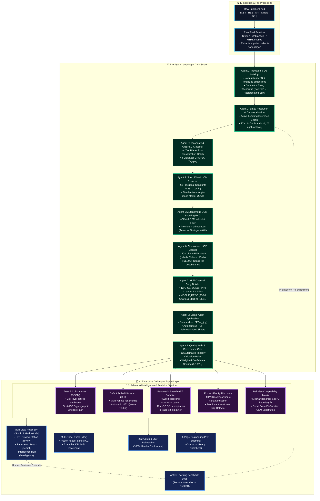

# ⚡ OmniSpec AI — Industrial Product Intelligence Platform

<p align="center">
  
  
  
  
  
</p>

> **Tagline:** *"From Cryptic Raw Part Rows to 252-Column Commerce-Ready Master Truth."*  
> **Challenge Track:** AI-Powered Product Intelligence for Industrial Commerce (UniHack Hackathon Challenge).

---

## 📑 Quick Navigation & Documentation Index

- [🎯 Problem Statement & Industrial Context](#-problem-statement--industrial-context)
- [🏛️ System Architecture Flowchart](#️-system-architecture-flowchart)
- [🤖 9-Agent Swarm Deep Dive & Code Links](#-9-agent-swarm-deep-dive--code-links)
- [🧠 Advanced Intelligence & Governance Services](#-advanced-intelligence--governance-services)
- [💻 Complete Tech Stack](#-complete-tech-stack)
- [📁 Repository Structure](#-repository-structure)
- [🚀 Quickstart & How to Run](#-quickstart--how-to-run)
- [🧪 Automated Testing & Verification Suite](#-automated-testing--verification-suite)
- [✨ Multi-View Web Studio Workbenches](#-multi-view-web-studio-workbenches)
- [📚 Solution Documentation & Benchmark Artifacts](#-solution-documentation--benchmark-artifacts)

---

## 🎯 Problem Statement & Industrial Context

### The Core Industrial Commerce Challenge (from `PS.txt`)
Industrial distributors and manufacturers manage millions of parts across technical catalogs, PDF datasheets, distributor feeds, and legacy ERP systems. Raw product data handed over by distributors is rarely e-commerce ready:
- **Cryptic & Abbreviated Strings:** Short, unstructured descriptions such as `"3/8 CPLG BRS 150#"` or `"4-1/2X.045X7/8 MTL CUT-OFF DISC"`.
- **Missing & Dummy Entities:** Crucial brand fields filled with placeholders like `"-- Unbranded --"`, `"-- No DIB Brand --"`, or raw vendor codes (`APPDE`, `BOICA`, `JAMIN`).
- **Inconsistent Units & Formats:** Non-standard units (`24in` vs `24 in`), decimals where tradespeople search fractions (`0.5 in` vs `1/2 in`), and conflicting dimension order.
- **Strict Compliance Governance:** Industrial e-commerce buyers need exact 252-column structured delivery schemas, strict character limits (`INVOICE_DESC` $\le 40$ chars ALL CAPS, `MOBILE_DESC` $60\text{--}80$ chars), legal brand casing with registered marks (`®`, `™`), and 100% zero-hallucination sourcing.

### OmniSpec AI's Solution
OmniSpec AI is an **autonomous, 9-agent LangGraph Swarm** backed by an in-memory **DuckDB Knowledge Engine** (27,000+ legal UniCat brands, 161,000 controlled LOVs, 63 fractional lookup tables) and **multimodal Vision/PDF RAG**. It takes a single 6-column raw supplier row and deterministically expands it into a fully validated, **252-column commerce-ready delivery record** with cell-level cryptographic provenance and zero hallucinations.

---

## 🏛️ System Architecture Flowchart



---

## 🤖 9-Agent Swarm Deep Dive & Code Links

Each micro-agent in the LangGraph DAG specializes in a distinct stage of catalog enrichment:

| Agent | Name | Code Implementation | Deep-Dive Documentation | Primary Architectural Function |
| :--- | :--- | :--- | :--- | :--- |
| **Agent 1** | **Ingestion & De-Noising** | [`agent_1_ingestion.py`](backend/app/agents/agent_1_ingestion.py) | [Agent 1 Guide](Solution/agents/README_Agent_1_Ingestion_Tokenization.md) | Strips dummy strings (`-- Unbranded --`), decodes HTML entities, isolates raw dimension tokens, extracts vendor codes (`APPDE`, `BOICA`), and translates trade jargon (`sawzall` $\rightarrow$ Reciprocating Saw). |
| **Agent 2** | **UniCat Entity Resolution** | [`agent_2_entity_resolution.py`](backend/app/agents/agent_2_entity_resolution.py) | [Agent 2 Guide](Solution/agents/README_Agent_2_Entity_Resolution.md) | Prioritizes active learning reviewer overrides, then executes C++ RapidFuzz matching across 27,000+ UniCat records with exact legal casing and mandatory trademark symbols (`FRIGIDAIRE®`, `Milwaukee®`, `3M™`, `DEWALT®`). |
| **Agent 3** | **Taxonomy & UNSPSC** | [`agent_3_taxonomy.py`](backend/app/agents/agent_3_taxonomy.py) | [Agent 3 Guide](Solution/agents/README_Agent_3_Taxonomy_Classification.md) | Maps product intent to a 4-tier category path (`Dept > Class > Fine > Subfine`), tags 8-digit UNSPSC codes, and triggers dynamic LOV schema validation from DuckDB. |
| **Agent 4** | **Spec, Dim & UOM Extractor** | [`agent_4_spec_uom.py`](backend/app/agents/agent_4_spec_uom.py) | [Agent 4 Guide](Solution/agents/README_Agent_4_Spec_UOM_Extractor.md) | Extracts dimension triplets (`L x W x H`), converts decimals to 63 exact fraction lookup standards (`50.25` $\rightarrow$ `50-1/4 in`), and enforces single-space UOM formatting (`24 in`, not `24in`). |
| **Agent 5** | **OEM Sourcing RAG** | [`agent_5_oem_sourcing.py`](backend/app/agents/agent_5_oem_sourcing.py) | [Agent 5 Guide](Solution/agents/README_Agent_5_OEM_Sourcing_RAG.md) | Discovers authoritative OEM manufacturer portals and technical PDF spec sheets while strictly blocking prohibited third-party marketplaces (Amazon, Grainger, eBay). |
| **Agent 6** | **Constrained LOV Mapper** | [`agent_6_lov_mapper.py`](backend/app/agents/agent_6_lov_mapper.py) | [Agent 6 Guide](Solution/agents/README_Agent_6_Constrained_LOV_Mapper.md) | Maps extracted specs into 50 structured attribute triples (`ATTRIBUTE_LABEL 1..50`, `ATTRIBUTE_VALUE 1..50`, `ATTRIBUTE_UOM 1..50` = 150 columns) adhering to 161,000+ controlled vocabularies. |
| **Agent 7** | **Multi-Channel Copy Builder** | [`agent_7_copy_builder.py`](backend/app/agents/agent_7_copy_builder.py) | [Agent 7 Guide](Solution/agents/README_Agent_7_MultiChannel_Copy_Builder.md) | Synthesizes multi-channel copy tiers: `INVOICE_DESC` ($\le 40$ chars ALL CAPS), `MOBILE_DESC` ($60\text{--}80$ chars), `SHORT_DESC` (PDP Title), and up to 20 structured bullet features. |
| **Agent 8** | **Digital Asset Synthesizer** | [`agent_8_digital_assets.py`](backend/app/agents/agent_8_digital_assets.py) | [Agent 8 Guide](Solution/agents/README_Agent_8_Digital_Asset_Synthesizer.md) | Formats canonical asset keys (`<Brand>_<MPN>.jpg`), spec sheets (`<Brand>_<MPN>_Specification_Sheet.pdf`), and document submittal references. |
| **Agent 9** | **Quality Audit & Governance** | [`agent_9_quality_audit.py`](backend/app/agents/agent_9_quality_audit.py) | [Agent 9 Guide](Solution/agents/README_Agent_9_Quality_Audit_HITL.md) | Runs 12 automated integrity rules, calculates weighted confidence scores ($0\text{--}100\%$), computes cell-level provenance, and routes low-confidence items to the HITL Review queue. |
| **Swarm DAG** | **LangGraph Orchestration** | [`graph.py`](backend/app/agents/graph.py) | [Master Architecture](Solution/MASTER_ARCHITECTURE_AND_MVP_PLAN.md) | State graph orchestration managing execution order, state immutability, error boundaries, and trace telemetry across all 9 agents. |

---

## 🧠 Advanced Intelligence & Governance Services

### 1. Data Bill of Materials (DBOM) & Cryptographic Lineage ([`dbom_service.py`](backend/app/services/dbom_service.py))
Every single cell in the 252-column output is tracked with its **source attribution type** (`OEM_PRIMARY`, `INFERRED_REGEX`, `SYNTACTIC_FORMULA`, `KB_LOOKUP`), exact source document locator, extraction timestamp, and an immutable **SHA-256 cryptographic lineage hash**.

### 2. Defect Probability Index (DPI) ([`defect_risk_scorer.py`](backend/app/services/defect_risk_scorer.py))
A calibrated multi-variate risk scoring engine evaluating character boundary overflows, missing mandatory dimensions, unregistered brand symbols, and classification confidence to automatically route items into the HITL Review queue.

### 3. Natural Language Parametric Constraint Search ([`parametric_search_engine.py`](backend/app/services/parametric_search_engine.py))
Translates freeform engineering queries (e.g., *"Dishwasher under 45 dBA stainless steel 120V 15A"*) into an **Abstract Syntax Tree (AST)** in $0.14\text{ ms}$, compiles dynamic DuckDB SQL, and produces side-by-side **Qualified vs. Disqualified** trade-off explanations with exact numerical deltas (e.g., *"+2.0 dBA over limit"*).

### 4. Product Family Discovery & Assortment Gap Detection ([`family_clustering_engine.py`](backend/app/services/family_clustering_engine.py))
Clusters flat, fragmented SKUs into canonical **Parent Product Families** by decomposing MPN variant suffixes (Bare Tool vs. 2-Battery Kit, Finish, Pipe Size). Identifies missing sizes in fractional sequences (`1/4 in`, `3/8 in`, `[MISSING 1/2 in]`, `3/4 in`) with evidence-backed gap classifications (`CONFIRMED_MANUFACTURER_GAP`).

### 5. Pairwise Compatibility & Substitute Matrix ([`compatibility_engine.py`](backend/app/services/compatibility_engine.py))
Evaluates physical, mechanical, and electrical compatibility (e.g. angle grinder arbor hole vs. cut-off wheel bore, voltage platforms) and surfaces direct cross-brand OEM functional substitutes with Form-Fit-Function scores.

---

## 💻 Complete Tech Stack

| Component | Technologies & Libraries |
| :--- | :--- |
| **Multi-Agent Orchestration** | LangGraph, LangChain Core, Python 3.11+ |
| **Relational Knowledge Base** | DuckDB (In-Memory Master DB), RapidFuzz (C++ SIMD string matching) |
| **Generative & Vision Fallback** | OpenAI GPT-4o-mini (Vision Spec RAG & Multimodal Extraction) |
| **Backend Web Server** | FastAPI, Uvicorn, Pydantic v2 (Validation & Schemas) |
| **Document & Excel Engines** | openpyxl (Multi-Sheet `.xlsx` Exporter), ReportLab (Autonomous PDF Datasheet Generator) |
| **Frontend Web Studio** | React 18, Vite, React Router DOM, TailwindCSS, Lucide React, Glassmorphism UI |
| **Testing & Verification** | Pytest, TestClient, AnyIO |

---

## 📁 Repository Structure

```text
OmniSpec/
├── backend/                             # Enterprise Backend & Agent Swarm
│   └── app/
│       ├── agents/                      # 9 Specialized Micro-Agents & LangGraph DAG
│       │   ├── agent_1_ingestion.py     # Ingestion & De-Noising
│       │   ├── agent_2_entity_resolution.py # 27K UniCat Brands & Trademark Normalizer
│       │   ├── agent_3_taxonomy.py      # 4-Tier Classpath & UNSPSC Classifier
│       │   ├── agent_4_spec_uom.py      # 63 Decimal Fractions & Master UOM Extractor
│       │   ├── agent_5_oem_sourcing.py  # OEM Portal Whitelist & Vision Spec RAG
│       │   ├── agent_6_lov_mapper.py    # 150-Column EAV Matrix & 161K Controlled LOVs
│       │   ├── agent_7_copy_builder.py  # Invoice <=40, Mobile 60-80, Short & Long Copy
│       │   ├── agent_8_digital_assets.py # Standardized JPGs & PDF Submittal Links
│       │   ├── agent_9_quality_audit.py # 12 Automated Integrity Validation Rules
│       │   └── graph.py                 # LangGraph State Graph & DAG Flow
│       ├── api/                         # 12 FastAPI REST Endpoints (Enrich, Search, Families, DBOM, DPI)
│       │   └── routes.py
│       ├── db/                          # DuckDB Client (27K Brands, 161K LOVs, Overrides)
│       │   └── duckdb_client.py
│       ├── schemas/                     # Pydantic 252-Column Delivery & State Schemas
│       │   ├── delivery_schema.py
│       │   ├── provenance_schema.py
│       │   ├── search_schema.py
│       │   ├── family_schema.py
│       │   └── state_schema.py
│       ├── services/                    # Core Intelligence Engines
│       │   ├── dbom_service.py          # Data Bill of Materials & SHA-256 Hash
│       │   ├── defect_risk_scorer.py    # Defect Probability Index (DPI)
│       │   ├── compatibility_engine.py  # Pairwise Mechanical & Electrical Matrix
│       │   ├── parametric_search_engine.py # AST Natural Language Compiler & SQL
│       │   ├── family_clustering_engine.py # Parent PDP & Assortment Gap Induction
│       │   ├── excel_exporter.py        # Styled Multi-Sheet Excel Engine
│       │   └── pdf_datasheet_generator.py # Autonomous 1-Page Engineering PDF Submittal
│       └── main.py                      # Application Entrypoint & CORS Config
│
├── frontend/                            # Vite + React 18 Multi-View SPA
│   ├── src/
│   │   ├── components/                  # Virtualized Grid252, DBOM Modal, Swarm Visualizer
│   │   │   ├── AgentSwarmVisualizer.jsx
│   │   │   ├── BatchUploadModal.jsx
│   │   │   ├── DashboardStats.jsx
│   │   │   ├── DBOMModal.jsx
│   │   │   ├── Grid252.jsx
│   │   │   ├── KnowledgeBaseExplorer.jsx
│   │   │   └── Navbar.jsx
│   │   ├── context/                     # Global CatalogProvider State
│   │   │   └── CatalogContext.jsx
│   │   ├── pages/                       # 4 Dedicated Routed Workbenches
│   │   │   ├── LandingPage.jsx          # Hero Overview & Capability Grid (/)
│   │   │   ├── StudioPage.jsx           # Live Sandbox & 252-Column Data Grid (/studio)
│   │   │   ├── ReviewPage.jsx           # HITL Quality Review & Active Learning (/review)
│   │   │   ├── SearchPage.jsx           # Parametric Engineering Constraint Search (/search)
│   │   │   └── IntelligencePage.jsx     # Product Families & Compatibility (/intelligence)
│   │   ├── App.jsx
│   │   └── index.css
│   └── package.json
│
├── tests/                               # Comprehensive Automated Test Suite (41 Tests)
│   ├── unit/                            # Unit tests for individual micro-agent stages
│   │   ├── test_agents_1_and_2.py
│   │   ├── test_agents_3_and_4.py
│   │   ├── test_agents_5_and_6.py
│   │   ├── test_agents_7_and_8.py
│   │   ├── test_copy_bounds_edge_cases.py
│   │   ├── test_denoising_edge_cases.py
│   │   ├── test_lov_and_taxonomy_deep.py
│   │   └── test_knowledge_base.py
│   ├── integration/                     # REST API & End-to-End Pipeline Suites
│   │   ├── test_all_api_endpoints.py
│   │   ├── test_pipeline_e2e.py
│   │   ├── test_ast_stress_cases.py
│   │   └── test_intelligence_services_deep.py
│   ├── features/                        # Enterprise Intelligence Capability Tests
│   │   ├── test_phase7_capabilities.py
│   │   ├── test_phase8_capabilities.py
│   │   └── test_phase9_capabilities.py
│   └── benchmarks/                      # Scale Benchmarking & 1,000 SKU Processors
│       ├── benchmark_ground_truth.py
│       ├── run_1000_batch_enrichment.py
│       └── Result.md
│
├── Solution/                            # Comprehensive Architectural & Agent Specs
│   ├── AGENTS.md                        # Complete Micro-Agent Execution Matrix
│   ├── MASTER_ARCHITECTURE_AND_MVP_PLAN.md # Master Architecture & Unilog Implementation Plan
│   └── agents/                          # Deep-Dive Readmes for Agents 1 through 9
│
├── test_agent.py                        # Root Stage-by-Stage Interactive Tracer CLI
├── summary.md                           # Comprehensive System Evaluation & Governance Summary
├── OmniSpec_Enriched_1000_Items_Delivery_252.csv # Full 1,000-SKU Deliverable (1.64 MB)
└── requirements.txt                     # Backend Python Dependencies
```

---

## 🚀 Quickstart & How to Run

### 1. Prerequisites & Environment Setup

```bash
# Clone the repository
git clone https://github.com/SharadJhanwar/OmniSpec.git
cd OmniSpec

# Create and activate Python virtual environment
python -m venv .venv

# On Windows:
.venv\Scripts\activate
# On macOS / Linux:
source .venv/bin/activate

# Install Python dependencies
pip install -r requirements.txt
```

### 2. Configure Environment Variables

Create a `.env` file in the root directory:
```env
OPENAI_API_KEY=your_openai_api_key_here
HOST=127.0.0.1
PORT=8000
ENVIRONMENT=development
```

### 3. Start the FastAPI Backend Server
```bash
.venv\Scripts\python -m uvicorn backend.app.main:app --host 127.0.0.1 --port 8000 --reload
```
* **Interactive Swagger API Docs:** [http://127.0.0.1:8000/docs](http://127.0.0.1:8000/docs)
* **Health Check:** [http://127.0.0.1:8000/health](http://127.0.0.1:8000/health)

### 4. Start the React Frontend Web Studio
In a second terminal:
```bash
cd frontend
npm install
npm run dev
```
* **Web Studio Application:** [http://localhost:5173](http://localhost:5173)

---

## 🧪 Automated Testing & Verification Suite

OmniSpec AI includes a comprehensive **41-test automated suite** spanning unit tests, integration tests, REST API endpoints, and intelligence engines:

```bash
# Run all 41 test suites
pytest tests/ -v
```

### Interactive Stage-by-Stage CLI Transformation Tracer
To trace how a single raw SKU is processed stage-by-stage through all 9 micro-agents in real time:

```bash
# Preset 1: Frigidaire Built-In Dishwasher (Large Appliances)
.venv\Scripts\python test_agent.py 1

# Preset 2: Milwaukee Metal Cut-Off Wheel (Abrasives & Cutting Tools)
.venv\Scripts\python test_agent.py 2

# Preset 3: Trex Composite Decking Board (Building Materials)
.venv\Scripts\python test_agent.py 3

# Preset 4: Brass Industrial Pipe Fitting (Plumbing)
.venv\Scripts\python test_agent.py 4

# Preset 5: Philips LED A19 Light Bulb (Lighting)
.venv\Scripts\python test_agent.py 5

# Preset 6: DEWALT 20V MAX Miter Saw (Power Tools)
.venv\Scripts\python test_agent.py 6

# Preset 7: OpenAI Generative Fallback & Latency Tracker
.venv\Scripts\python test_agent.py 7
```

### Run 1,000-SKU Scale Batch Processing
```bash
.venv\Scripts\python tests/benchmarks/run_1000_batch_enrichment.py
```
* Generates the 252-column CSV deliverable: [`OmniSpec_Enriched_1000_Items_Delivery_252.csv`](./OmniSpec_Enriched_1000_Items_Delivery_252.csv).

---

## ✨ Multi-View Web Studio Workbenches

1. **`Studio & Grid` (`/studio`)**:
   - **Live Single-SKU Sandbox:** Type raw descriptions, select presets, and inspect stage-by-stage transformation traces.
   - **Virtualized 252-Column Data Grid:** Scroll horizontally across all 252 fields with frozen key identifiers.
   - **Drag & Drop CSV Ingestion:** Upload any raw distributor CSV feed and enrich at scale.
2. **`HITL Review Station` (`/review`)**:
   - **Side-by-Side Diff Comparison:** Compare raw supplier input against proposed 252-column master fields.
   - **Live Character Limit Progress Meters:** Visual badges ensuring `INVOICE_DESC` ($\le 40$) and `MOBILE_DESC` ($60\text{--}80$) never violate channel guidelines.
   - **Active Learning Overrides:** Persists human reviewer corrections into DuckDB (`kb_active_overrides`) so subsequent swarm runs automatically adopt approved master entities.
3. **`Parametric Search Studio` (`/search`)**:
   - **AST Compiler:** Translates freeform natural language engineering queries into DuckDB SQL.
   - **Trade-Off Explainer Cards:** Side-by-side Qualified vs. Disqualified candidate evaluation with exact numerical deltas.
4. **`Intelligence Hub` (`/intelligence`)**:
   - **Product Families & Variant Induction:** Clusters flat SKUs into Parent PDPs with multi-axis variant matrices and identifies missing sizes in fractional sequences (`CONFIRMED_MANUFACTURER_GAP`).
   - **Industrial Compatibility Matrix:** Pairwise mechanical/electrical evaluator and cross-brand OEM functional equivalents.
   - **UniCat Knowledge Graph Explorer:** Visual dictionary browsing 27,000+ UniCat Brands, 161,000 LOVs, and the Trade Jargon Thesaurus.
5. **Data Bill of Materials (DBOM) Modal**:
   - Cell-level source attribution, confidence scores, extraction methods, and SHA-256 cryptographic lineage proof.
6. **1-Click Multi-Sheet Excel (`.xlsx`) Export**:
   - Generates styled `.xlsx` delivery workbooks with frozen panes (`C2`), auto-fitted columns, and an executive governance scorecard.
7. **Autonomous OEM Technical PDF Datasheet Generator**:
   - Generates 1-page engineering specification submittals (`<Brand>_<MPN>_Specification_Sheet.pdf`) for contractors.

---

## 📚 Solution Documentation & Benchmark Artifacts

- **[Master Architecture & Implementation Plan](Solution/MASTER_ARCHITECTURE_AND_MVP_PLAN.md)**: Full Unilog guideline mapping and architectural blueprint.
- **[Micro-Agent Specification Matrix](Solution/AGENTS.md)**: Detailed execution rules for Agents 1 through 9.
- **[System Evaluation & Governance Summary](summary.md)**: Edge-case boundaries, uniqueness analysis, and enterprise compliance report.
- **[1,000-SKU Master CSV Deliverable](OmniSpec_Enriched_1000_Items_Delivery_252.csv)**: Complete 252-column dataset generated across all 1,000 input catalog rows.

---

## 📄 License
MIT License. Built for the UniHack Hackathon Challenge.
