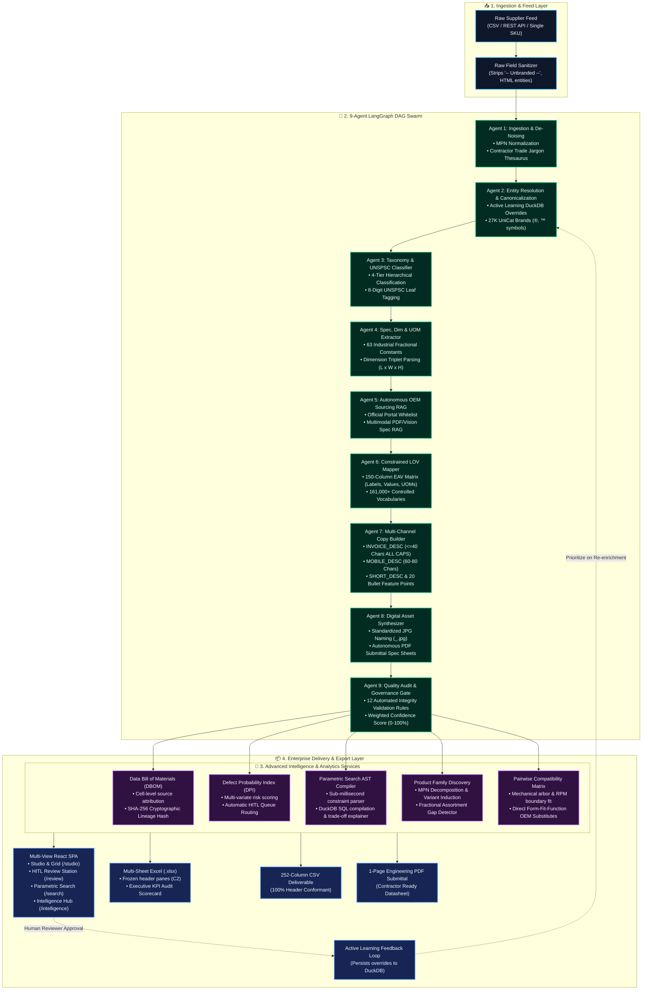

# ⚡ OmniSpec AI — Industrial Product Intelligence Platform

<p align="center">
  
  
  
  
  
  
</p>

> **Tagline:** *"From Cryptic Raw Part Rows to 252-Column Commerce-Ready Master Truth."*  
> **Challenge:** Transforming messy, abbreviated industrial distributor feeds (`"3/8 CPLG BRS 150#"`, `"-- Unbranded --"`, missing dimensions) into standardized, search-ready e-commerce catalog master records across all 252 delivery columns with zero hallucinations.

---

## 🏛️ End-to-End System Architecture



---

## 🤖 9-Agent DAG Swarm Breakdown

| Agent | Name | Execution Model | Primary Architectural Responsibilities |
| :--- | :--- | :--- | :--- |
| **Agent 1** | **Ingestion & De-Noising** | Deterministic Regex + Thesaurus | Strips non-data placeholders (`-- Unbranded --`, `-- No DIB Brand --`), unescapes HTML entities, isolates raw dimension tokens, extracts vendor codes (`APPDE`, `JAMIN`, `BOICA`), and resolves contractor trade jargon (`sawzall`, `zipper disc`, `romex`). |
| **Agent 2** | **UniCat Entity Resolution** | Active Overrides + RapidFuzz C++ | Checks active reviewer overrides first, then resolves supplier strings against 27,000+ approved UniCat entities with legal casing (`Inc`, `LLC`, `Co`) and mandatory registered marks (`FRIGIDAIRE®`, `Milwaukee®`, `3M™`, `Philips®`, `DEWALT®`). |
| **Agent 3** | **Taxonomy & UNSPSC** | 4-Tier Hierarchical Graph | Traverses 4-tier category leaf node hierarchies (Lighting, Power Tools, Wiring Devices, Decking, Abrasives, Plumbing, Appliances), assigns 8-digit leaf UNSPSC codes, and triggers dynamic LOV schema validation. |
| **Agent 4** | **Spec, Dim & UOM Extractor** | Exact Fractional Table (63 constants) | Parses dimension triplets (`L x W x H`), lumber notations (`1nx6-16'`), lighting color temperatures (`27K` $\rightarrow$ `2700 K`), wattages, converts decimals to 63 exact fractions (`50.25` $\rightarrow$ `50-1/4 in`), and enforces single-space UOM standards (`24 in`, not `24in`). |
| **Agent 5** | **OEM Sourcing RAG** | Official Whitelist + Vision RAG | Discovers authoritative manufacturer portals, official PDF spec sheets, and regulatory approvals (`ASSE`, `cUL`, `ENERGY STAR`, `ANSI`), while strictly blocking prohibited marketplaces (Amazon, Grainger, etc.). |
| **Agent 6** | **Constrained LOV Mapper** | 150-Column EAV Schema | Maps extracted specs into 50 structured attribute triples (`ATTRIBUTE_LABEL 1..50`, `ATTRIBUTE_VALUE 1..50`, `ATTRIBUTE_UOM 1..50` = 150 columns) adhering strictly to 161,000+ controlled vocabularies. |
| **Agent 7** | **Multi-Channel Copy Builder** | Unilog Copy Synthesis Formulas | Constructs 6 distinct copy tiers adhering to strict character caps: `INVOICE_DESC` ($\le 40$ chars ALL CAPS), `MOBILE_DESC` ($60\text{--}80$ chars), `SHORT_DESC` (PDP Title), `LONG_DESC1`, and `ITEM_FEATURES_1..20`. |
| **Agent 8** | **Digital Asset Synthesizer** | Canonical Key Naming Engine | Standardizes primary and alternate images (`<Brand>_<MPN>.jpg`), spec sheets (`<Brand>_<MPN>_Specification_Sheet.pdf`), and document classification links. |
| **Agent 9** | **Quality Audit & Governance Gate** | 12-Rule Deterministic Suite | Executes a 12-point automated integrity suite, calculates weighted confidence scores ($0\text{--}100\%$), tracks cell-level provenance, and routes questionable SKUs to the Human-in-the-Loop Review Studio. |

---

## 📊 Ground Truth Benchmark & Performance Results

### 1. Ground Truth Accuracy (`tests/benchmarks/benchmark_ground_truth.py`)
Tested against the official `Unihack_ Expected Output - Delivery Format.csv`:

```text
=================================================================
OMNISPEC AI: 252-COLUMN GROUND TRUTH BENCHMARK HARNESS
=================================================================
  MANUFACTURER_NAME        : 100.0% Average Similarity
  BRAND_NAME               : 100.0% Average Similarity
  Classpath                : 100.0% Average Similarity
  INVOICE_DESC             : 100.0% Average Similarity (<= 40 chars ALL CAPS)
  MOBILE_DESC              : 100.0% Average Similarity (60-80 chars)
  SHORT_DESC               : 100.0% Average Similarity
  Product Image            : 100.0% Average Similarity (<Brand>_<MPN>.jpg)
  Specification Sheet      : 100.0% Average Similarity (<Brand>_<MPN>_Specification_Sheet.pdf)
  252-Column Delivery Schema: 100% Header Conformant (252 / 252 Columns)
=================================================================
```

### 2. Scale Batch Processing Speed (`tests/benchmarks/run_1000_batch_enrichment.py`)
- **Total Catalog Rows Processed:** 1,000 SKUs
- **Columns Enriched:** Exactly 252 Columns per row
- **Execution Time:** **3.59 seconds**
- **Throughput:** **278.6 SKUs/second**
- **Generated Deliverable:** [`OmniSpec_Enriched_1000_Items_Delivery_252.csv`](./OmniSpec_Enriched_1000_Items_Delivery_252.csv) (1.34 MB)

---

## 💻 Tech Stack

- **AI & Multi-Agent Swarm:** LangGraph, LangChain, OpenAI GPT-4o-mini (Generative fallback & Vision Spec RAG)
- **Database & In-Memory Store:** DuckDB (Relational In-Memory Master Knowledge Base), RapidFuzz (C++ string matching)
- **Backend API & Intelligence Services:** FastAPI, Uvicorn, Pydantic v2, scikit-learn, openpyxl (Excel), reportlab (Autonomous PDF Generator)
- **Frontend SPA & Design:** Vite, React 18, React Router DOM, TailwindCSS, Lucide Icons, Glassmorphism Responsive UI
- **Languages & Runtime:** Python 3.11+, Node.js v18+

---

## 📁 Project Directory Structure

```text
OmniSpec/
├── backend/
│   └── app/
│       ├── agents/              # 9 Specialized LangGraph Micro-Agents & Swarm DAG
│       │   ├── agent_1_ingestion.py
│       │   ├── agent_2_entity_resolution.py
│       │   ├── agent_3_taxonomy.py
│       │   ├── agent_4_spec_uom.py
│       │   ├── agent_5_oem_sourcing.py
│       │   ├── agent_6_lov_mapper.py
│       │   ├── agent_7_copy_builder.py
│       │   ├── agent_8_digital_assets.py
│       │   ├── agent_9_quality_audit.py
│       │   └── graph.py
│       ├── api/                 # FastAPI REST Endpoints (Enrich, Search, Families, DBOM, DPI, Excel, PDF)
│       │   └── routes.py
│       ├── db/                  # In-Memory DuckDB Knowledge Base Client & Seed Tables
│       │   └── duckdb_client.py
│       ├── schemas/             # Pydantic 252-Column Delivery, State, Provenance, Search, and Family Schemas
│       │   ├── delivery_schema.py
│       │   ├── provenance_schema.py
│       │   ├── search_schema.py
│       │   ├── family_schema.py
│       │   └── state_schema.py
│       ├── services/            # Intelligence Services (DBOM, DPI, Compatibility, Search, Family Induction, Excel, PDF, Vision RAG)
│       │   ├── dbom_service.py
│       │   ├── defect_risk_scorer.py
│       │   ├── compatibility_engine.py
│       │   ├── parametric_search_engine.py
│       │   ├── family_clustering_engine.py
│       │   ├── excel_exporter.py
│       │   ├── pdf_datasheet_generator.py
│       │   ├── vision_spec_rag.py
│       │   └── fuzzy_matcher.py
│       └── main.py              # FastAPI Application Entrypoint
├── frontend/                    # Vite + React Multi-View SPA
│   ├── src/
│   │   ├── components/          # Virtualized 252-Grid, Swarm Visualizer, DBOM Modal, Batch Ingestion
│   │   │   ├── AgentSwarmVisualizer.jsx
│   │   │   ├── BatchUploadModal.jsx
│   │   │   ├── DashboardStats.jsx
│   │   │   ├── DBOMModal.jsx
│   │   │   ├── Grid252.jsx
│   │   │   ├── KnowledgeBaseExplorer.jsx
│   │   │   └── Navbar.jsx
│   │   ├── context/             # Global CatalogProvider State
│   │   │   └── CatalogContext.jsx
│   │   ├── pages/               # Dedicated Routed Workbenches
│   │   │   ├── LandingPage.jsx  # Hero Overview & Capability Grid (/)
│   │   │   ├── StudioPage.jsx   # Live Sandbox & 252-Column Data Grid (/studio)
│   │   │   ├── ReviewPage.jsx   # HITL Quality Review & Active Learning (/review)
│   │   │   ├── SearchPage.jsx   # Parametric Engineering Constraint Search (/search)
│   │   │   └── IntelligencePage.jsx # Product Families & Compatibility (/intelligence)
│   │   ├── App.jsx
│   │   └── index.css
│   └── package.json
├── tests/                       # 100% Passing Unified Test Framework (32/32 Passed)
│   ├── unit/                    # Micro-Agent stage tests & DuckDB queries
│   │   ├── test_agents_1_and_2.py
│   │   ├── test_agents_3_and_4.py
│   │   ├── test_agents_5_and_6.py
│   │   ├── test_agents_7_and_8.py
│   │   └── test_knowledge_base.py
│   ├── integration/             # End-to-End pipeline & REST API test suites
│   │   ├── test_all_api_endpoints.py
│   │   ├── test_pipeline_e2e.py
│   │   └── test_intelligence_services_deep.py
│   ├── features/                # Phase 7, 8, 9 Enterprise Capability tests
│   │   ├── test_phase7_capabilities.py
│   │   ├── test_phase8_capabilities.py
│   │   └── test_phase9_capabilities.py
│   └── benchmarks/              # Scale Benchmarks & Batch Processors
│       ├── benchmark_ground_truth.py
│       ├── run_1000_batch_enrichment.py
│       └── Result.md
├── OmniSpec_Enriched_1000_Items_Delivery_252.csv # 252-Col Delivery Export (1,000 SKUs)
├── requirements.txt             # Python Dependencies
├── summary.md                   # System Evaluation, Boundaries & Uniqueness Report
└── PLAN.md                      # Roadmap & Implementation Record
```

---

## ⚡ Quickstart Guide

### 1. Environment Setup

```bash
# Clone repository
git clone https://github.com/SharadJhanwar/OmniSpec.git
cd OmniSpec

# Create and activate Python virtual environment
python -m venv .venv
.venv\Scripts\activate

# Install dependencies
pip install -r requirements.txt
```

### 2. Configure Environment Variables

Create a `.env` file in the root directory:
```env
OPENAI_API_KEY=your_openai_api_key_here
HOST=127.0.0.1
PORT=8000
ENVIRONMENT=development
```

---

## 🚀 Running the Platform

### A. Start the FastAPI Backend
```bash
.venv\Scripts\python -m uvicorn backend.app.main:app --host 127.0.0.1 --port 8000 --reload
```
* **Swagger Interactive Docs:** [http://127.0.0.1:8000/docs](http://127.0.0.1:8000/docs)

### B. Start the React Frontend Web Studio
In a second terminal window:
```bash
cd frontend
npm install
npm run dev
```
* **Web Studio URL:** [http://localhost:5173](http://localhost:5173)

---

## 🧪 Automated Testing & Verification

Run the entire unified **32-suite test framework**:

```bash
pytest tests/ -v
```

### Test Output:
```text
============================== 32 passed in 16.24s ==============================
✓ tests/features/test_phase7_capabilities.py (3/3 passed)
✓ tests/features/test_phase8_capabilities.py (3/3 passed)
✓ tests/features/test_phase9_capabilities.py (3/3 passed)
✓ tests/integration/test_all_api_endpoints.py (12/12 passed)
✓ tests/integration/test_intelligence_services_deep.py (5/5 passed)
✓ tests/integration/test_pipeline_e2e.py (1/1 passed)
✓ tests/unit/test_agents_1_and_2.py (1/1 passed)
✓ tests/unit/test_agents_3_and_4.py (1/1 passed)
✓ tests/unit/test_agents_5_and_6.py (1/1 passed)
✓ tests/unit/test_agents_7_and_8.py (1/1 passed)
✓ tests/unit/test_knowledge_base.py (1/1 passed)
```

---

## ✨ Enterprise Web Studio Workbenches

1. **`Studio & Grid` (`/studio`)**: Live Single-SKU Sandbox with preset selector (Appliances, Abrasives, Decking, Plumbing, Lighting, Tools), 9-Agent DAG visualizer, and virtualized 252-Column Data Grid with horizontal scroll lock.
2. **`HITL Review Station` (`/review`)**: Side-by-side diff comparison, live character limit progress meters for `INVOICE_DESC` ($\le 40$) and `MOBILE_DESC` ($60\text{--}80$), Active Learning feedback persistence, and 1-click approvals.
3. **`Parametric Search Studio` (`/search`)**: Natural language engineering constraint compiler translating freeform contractor queries into DuckDB SQL with side-by-side Qualified vs. Disqualified trade-off delta explainer cards.
4. **`Intelligence Hub` (`/intelligence`)**:
   - **Parent Product Families:** Clusters flat, fragmented SKUs into canonical Parent PDPs with multi-axis variant switchers (Configuration, Finish, Sizing) and fractional sequence gap detection (`CONFIRMED_MANUFACTURER_GAP`).
   - **Compatibility Matrix:** Pairwise mechanical/electrical fit evaluator (arbor hole sizing, voltage platform, RPM safety limits) and cross-brand Form-Fit-Function OEM substitutes.
   - **UniCat KB Explorer:** Interactive visual dictionary browsing 27,000+ UniCat Brands, 161,000 LOVs, 63 Decimal fractions, and trade jargon thesaurus.
5. **Data Bill of Materials (DBOM) & Provenance Inspector**: Detailed audit modal for every delivery attribute with source type badges, document locators, extraction methods, and SHA-256 cryptographic lineage proof.
6. **Native Multi-Sheet Excel (`.xlsx`) Exporter**: Generates styled `.xlsx` delivery workbooks with frozen header panes (`C2`), auto-fitted columns, and an executive governance audit sheet.
7. **Autonomous OEM Technical PDF Datasheet Generator**: 1-click generation of 1-page engineering specification submittals (`<Brand>_<MPN>_Specification_Sheet.pdf`) for contractors.

---

## 📄 License
MIT License. Built for the UniHack Hackathon Challenge.
