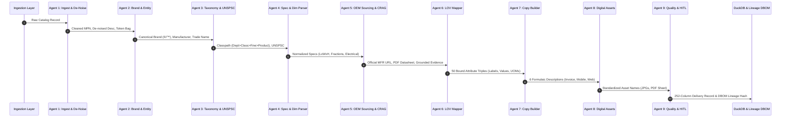

# 🤖 OmniSpec AI — Multi-Agent System Architecture & Swarm Orchestration
### *Comprehensive Multi-Agent Specification for Autonomous Industrial Product Intelligence*

> **Document Type:** Multi-Agent Architecture, Technical Stack, and Inter-Agent Communication Specification  
> **Platform:** OmniSpec AI (Autonomous B2B Industrial Catalog Intelligence Engine)  
> **Output Standard:** 252-Column Unilog Master Delivery Standard  

---

## 1. Executive Multi-Agent Overview

Industrial product enrichment cannot be solved by a single monolithic LLM prompt. Pure generative models hallucinate technical dimensions, invent non-standard units of measure (UOM), miss legal brand trademarks (`®`/`™`), and violate strict character limits (e.g. Invoice $\le 40$ chars, Mobile $60\text{--}80$ chars).

**OmniSpec AI** implements a **Decoupled 9-Agent Directed Acyclic Graph (DAG) Swarm** orchestrated by a central **ReAct Cognitive Brain**. Every agent is a specialized micro-service combining **deterministic algorithms** (C++ fuzzy matching, compiled regexes, mathematical fraction engines, relational lookups) with **generative reasoning** (Vision-Language Models, constrained extraction, semantic RAG).

```
+-------------------------------------------------------------------------------------------------------------------------------+
|                                            OMNISPEC AI 9-AGENT SWARM TOPOLOGY                                                  |
|                                                                                                                               |
|  [Raw Catalog Row]                                                                                                            |
|         │                                                                                                                     |
|         ▼                                                                                                                     |
|  ┌──────────────┐      ┌──────────────┐      ┌──────────────┐      ┌──────────────┐      ┌──────────────┐                     |
|  │   AGENT 1    │ ───► │   AGENT 2    │ ───► │   AGENT 3    │ ───► │   AGENT 4    │ ───► │   AGENT 5    │                     |
|  │  Ingestion & │      │    Entity    │      │  Taxonomy &  │      │ Spec, Dim &  │      │ OEM Sourcing │                     |
|  │ De-Noising   │      │  Resolution  │      │ Classification│     │  UOM Parser  │      │  & CRAG RAG  │                     |
|  └──────────────┘      └──────────────┘      └──────────────┘      └──────────────┘      └──────────────┘                     |
|                                                                                                  │                            |
|                                                                                                  ▼                            |
|  ┌──────────────┐      ┌──────────────┐      ┌──────────────┐      ┌──────────────┐      ┌──────────────┐                     |
|  │ Final Output │ ◄─── │   AGENT 9    │ ◄─── │   AGENT 8    │ ◄─── │   AGENT 7    │ ◄─── │   AGENT 6    │                     |
|  │ (252 Columns)│      │Quality, Audit│      │Digital Asset │      │ Multi-Channel│      │ Constrained  │                     |
|  │ & Analytics  │      │    & HITL    │      │ Synthesizer  │      │ Copy Builder │      │  LOV Mapper  │                     |
|  └──────────────┘      └──────────────┘      └──────────────┘      └──────────────┘      └──────────────┘                     |
+-------------------------------------------------------------------------------------------------------------------------------+
```

---

## 2. Agent Matrix & Responsibilities

| # | Agent Name | Primary Mission | Deterministic Tools | AI / Generative Role | Primary Output Fields |
| :-: | :--- | :--- | :--- | :--- | :--- |
| **1** | **Ingestion & De-Noising** | Cleans raw input, strips placeholders, resolves contractor trade slang. | Regex, Unicode normalizers, `industry_thesaurus` table. | Contextual token tagger. | Cleaned tokens, de-noised `Part_Desc`, mapped slang terms, hash ID. |
| **2** | **Brand & Entity Resolution** | Checks active reviewer overrides, resolves supplier names to canonical UniCat brands. | RapidFuzz C++, UniCat 27K dictionary, `kb_active_overrides` lookup. | Evidence-backed LLM disambiguator using live DuckDuckGo web search snippets. | `MANUFACTURER_NAME`, `BRAND_NAME`, `TRADE_NAME`, `®`/`™`. |
| **3** | **Taxonomy & Classification** | Classifies SKU into 4-tier Classpath and assigns 8-digit leaf UNSPSC. | Category Tree Trie, UNSPSC lookup. | Hierarchical category inference for novel products. | `Classpath`, `UNSPSC`, `Dept`, `Class`, `Fine`, `Product Name`. |
| **4** | **Spec, Dim & UOM Parser** | Extracts physical dimensions, electrical specs, converts to 63 exact fractions. | 63-entry fraction lookup, 500+ Master UOM table, compiled regexes. | Complex technical phrasing parser. | `LENGTH`, `WIDTH`, `HEIGHT`, `WEIGHT`, normalized UOMs, electrical specs. |
| **5** | **OEM Sourcing & CRAG RAG** | Discovers official OEM URLs, blocks marketplaces, ingests PDF/drawing specs. | Domain whitelist/blacklist, URL normalizer. | Corrective RAG (CRAG) with multi-engine web search & PDF submittal generator. | `MFR URL`, `Ref URL 1..5`, raw spec tables, certs. |
| **6** | **Constrained LOV Mapper** | Binds raw specs to 161,000-row UniCat LOV & deep category LOVs across 50 triples. | Inverted index search, Many-to-One synonym dictionary, 50-slot triple padding. | Constrained value alignment & synonym resolution. | `ATTRIBUTE_LABEL 1..50`, `ATTRIBUTE_VALUE 1..50`, `ATTRIBUTE_UOM 1..50`. |
| **7** | **Multi-Channel Copy Builder** | Generates 6 distinct formulaic descriptions adhering to strict character caps. | Character counter, uppercase transformer, strict template engine. | High-converting marketing copy & bullet point generator with latency tracing. | `INVOICE_DESC` ($\le 40$ ALL CAPS), `MOBILE_DESC` ($60\text{--}80$), `SHORT_DESC`, `LONG_DESC1`, `ITEM_FEATURES_1..20`. |
| **8** | **Digital Asset Synthesizer** | Builds canonical asset filenames and validates technical doc links. | String formatters, MIME validators. | Visual asset relevance scorer. | `Product Image`, `Alternate Image 1..4`, `Specification Sheet`, `SDS`, `RoHS`. |
| **9** | **Quality Audit & HITL** | Runs 12 integrity checks, computes Evidence-Aware confidence, routes to HITL. | 12-rule validation suite, Levenshtein distance scorer, 5-pillar confidence engine. | Explainable anomaly detector. | Confidence scores ($0\text{--}100\%$), audit flags, HITL review queue payload. |

---

## 3. Inter-Agent Data Flow & State Machine

The swarm communicates via a **Strictly Typed Pydantic State Container** (`ProductEnrichmentState`). Each agent consumes the current state, executes its deterministic/AI tasks, and returns a verified state delta.



---

## 4. Variable-Level & Cell-Level Caching Architecture

Every enriched column in OmniSpec AI tracks variable-level provenance and caching metadata:

1. **Cached Knowledge (`is_cached = True`)**:
   - Matches an active human override in DuckDB (`kb_active_overrides`) or exact Master KB match with $\ge 95\%$ confidence.
   - **Variable Confidence:** $1.00$ ($100.0\%$).
   - **HITL Routing:** `needs_hitl = False` (Zero human intervention needed).
2. **Uncached Knowledge (`is_cached = False`)**:
   - First-time ingestion, newly inferred, or web-discovered without verified human signoff.
   - **Variable Confidence:** Computed via 5-Pillar Evidence Audit.
   - **HITL Routing:** `needs_hitl = True` (Routes to human specialist in HITL Station).
   - Once approved by a specialist, the override persists in DuckDB $\rightarrow$ all subsequent requests resolve instantly from cache with 100% confidence!

---

## 5. Execution Tracing & Multi-Agent Observability

In batch and single-SKU execution, every agent emits structured real-time logs and records an `AgentTrace` object containing:
- `agent_name`: Human-readable identifier.
- `execution_time_ms`: Sub-millisecond latency tracker.
- `notes`: Bullet points detailing exact extractions, formulas, and decisions.
- `extracted_data`: Key-value snapshot of state contributions.

These traces are displayed in real-time in the terminal, streamed over WebSockets to the React frontend Studio, and saved in `output.json` under `"agent_traces"`.
