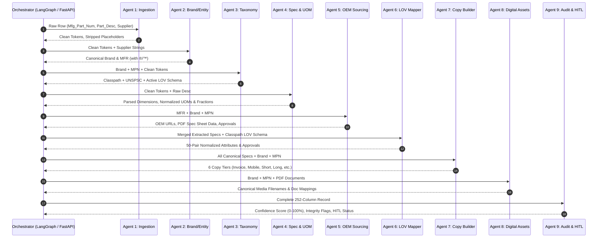

# 🤖 OmniSpec AI — Multi-Agent System Architecture & Swarm Orchestration
### *Comprehensive Multi-Agent Specification for Autonomous Industrial Product Intelligence*

> **Document Type:** Multi-Agent Architecture, Technical Stack, and Inter-Agent Communication Specification  
> **Platform:** OmniSpec AI (Autonomous B2B Industrial Catalog Intelligence Engine)  
> **Output Standard:** 252-Column Unilog Master Delivery Standard  

---

## 1. Executive Multi-Agent Overview

Industrial product enrichment cannot be solved by a single monolithic LLM prompt. Pure generative models hallucinate technical dimensions, invent non-standard units of measure (UOM), miss legal brand trademarks (`®`/`™`), and violate strict character limits (e.g. Invoice $\le 40$ chars, Mobile $60\text{--}80$ chars).

**OmniSpec AI** implements a **Decoupled 9-Agent Directed Acyclic Graph (DAG) Swarm**. Every agent is a specialized micro-service combining **deterministic algorithms** (C++ fuzzy matching, compiled regexes, mathematical fraction engines, relational lookups) with **generative reasoning** (Vision-Language Models, constrained extraction, semantic RAG).

```
+-------------------------------------------------------------------------------------------------------------------------------+
|                                            OMNISPEC AI 9-AGENT SWARM TOPOLOGY                                                  |
|                                                                                                                               |
|  [Raw Catalog Row]                                                                                                            |
|         │                                                                                                                     |
|         ▼                                                                                                                     |
|  ┌──────────────┐      ┌──────────────┐      ┌──────────────┐      ┌──────────────┐      ┌──────────────┐                     |
|  │   AGENT 1    │ ───► │   AGENT 2    │ ───► │   AGENT 3    │ ───► │   AGENT 4    │ ───► │   AGENT 5    │                     |
|  │  Ingestion & │      │    Entity    │      │  Taxonomy &  │      │ Spec, Dim &  │      │ OEM Sourcing │                     |
|  │ De-Noising   │      │  Resolution  │      │ Classification│     │  UOM Parser  │      │    & RAG     │                     |
|  └──────────────┘      └──────────────┘      └──────────────┘      └──────────────┘      └──────────────┘                     |
|                                                                                                  │                            |
|                                                                                                  ▼                            |
|  ┌──────────────┐      ┌──────────────┐      ┌──────────────┐      ┌──────────────┐      ┌──────────────┐                     |
|  │ Final Output │ ◄─── │   AGENT 9    │ ◄─── │   AGENT 8    │ ◄─── │   AGENT 7    │ ◄─── │   AGENT 6    │                     |
|  │ (252 Columns)│      │Quality, Audit│      │Digital Asset │      │ Multi-Channel│      │ Constrained  │                     |
|  │ & Analytics  │      │    & HITL    │      │ Synthesizer  │      │ Copy Builder │      │  LOV Mapper  │                     |
|  └──────────────┘      └──────────────┘      └──────────────┘      └──────────────┘      └──────────────┘                     |
+-------------------------------------------------------------------------------------------------------------------------------+
```

---

## 2. Agent Matrix & Responsibilities

| # | Agent Name | Primary Mission | Deterministic Tools | AI / Generative Role | Primary Output Fields |
| :-: | :--- | :--- | :--- | :--- | :--- |
| **1** | **Ingestion & De-Noising** | Cleans raw input, strips placeholders, tokenizes strings. | Regex, Unicode normalizers, hash tables. | Contextual token tagger. | Cleaned tokens, de-noised `Part_Desc`, hash ID. |
| **2** | **Brand & Entity Resolution** | Resolves noisy supplier names to canonical UniCat manufacturers and brands. | RapidFuzz C++, UniCat 27K dictionary lookup. | Semantic brand disambiguation. | `MANUFACTURER_NAME`, `BRAND_NAME`, `TRADE_NAME`, `®`/`™`. |
| **3** | **Taxonomy & Classification** | Classifies SKU into 4-tier Classpath and assigns UNSPSC. | Category Tree Trie, UNSPSC lookup. | Hierarchical category inference. | `Classpath`, `UNSPSC`, `Dept`, `Class`, `Fine`, `Product Name`. |
| **4** | **Spec, Dim & UOM Parser** | Extracts physical dimensions, electrical specs, converts to fractions. | 63-entry fraction lookup, 500+ UOM table, compiled regexes. | Complex technical phrasing parser. | `LENGTH`, `WIDTH`, `HEIGHT`, `WEIGHT`, normalized UOMs, electrical specs. |
| **5** | **OEM Sourcing & RAG** | Discovers official OEM URLs and extracts spec sheets from PDFs/pages. | Domain whitelist/blacklist, URL normalizer. | Playwright browser agent, Vision-Language PDF parser. | `MFR URL`, `Ref URL 1..5`, raw spec tables, certs. |
| **6** | **Constrained LOV Mapper** | Binds raw specs to 161,000-row UniCat LOV & deep category LOVs. | Inverted index search, Many-to-One synonym dictionary. | Constrained value alignment & synonym resolution. | `ATTRIBUTE_LABEL 1..50`, `ATTRIBUTE_VALUE 1..50`, `ATTRIBUTE_UOM 1..50`, `Standard/Approvals`. |
| **7** | **Multi-Channel Copy Builder** | Generates 6 distinct formulaic descriptions adhering to char limits. | Character counter, upper-caser, strict template engine. | High-converting marketing copy & bullet point generator. | `INVOICE_DESC`, `MOBILE_DESC`, `SHORT_DESC`, `LONG_DESC1`, `RETAIL_DESC`, `MARKETING_DESCRIPTION`, `ITEM_FEATURES_1..20`. |
| **8** | **Digital Asset Synthesizer** | Builds canonical asset filenames and validates technical doc links. | String formatters, MIME validators. | Visual asset relevance scorer. | `Product Image`, `Alternate Image 1..4`, `Specification Sheet`, `SDS`, `RoHS`, etc. |
| **9** | **Quality Audit & HITL** | Runs 12 integrity checks, computes confidence scores, routes to HITL. | 12-rule validation suite, Levenshtein distance scorer. | Explainable anomaly detector. | Confidence scores ($0\text{--}100\%$), audit flags, HITL review queue payload. |

---

## 3. Inter-Agent Data Flow & State Machine

The swarm communicates via a **Strictly Typed Pydantic State Container** (`ProductEnrichmentState`). Each agent consumes the current state, executes its deterministic/AI tasks, and returns a verified state delta.



---

## 4. End-to-End Technology Stack

```
+-------------------------------------------------------------------------------------------------------------------------------+
|                                                  OMNISPEC AI TECH STACK                                                       |
+-------------------------------------------------------------------------------------------------------------------------------+
| LAYER                  | COMPONENT                       | PURPOSE & BENEFIT                                                  |
+------------------------+---------------------------------+--------------------------------------------------------------------+
| Orchestration & API    | FastAPI 0.111+ / Python 3.11    | Ultra-fast async execution with automatic OpenAPI docs.            |
| Agent Framework        | LangGraph / LangChain Core      | State graph workflow with conditional routing and retry logic.     |
| Data Validation        | Pydantic v2 (Strict Schema)     | Type safety and constraint validation for all 252 columns.         |
| Fuzzy Entity Search    | RapidFuzz 3.8+ (C++ engine)     | Sub-millisecond string matching over 27,000+ UniCat records.       |
| In-Memory Relational   | DuckDB 1.0+ / SQLite 3          | High-speed vector/SQL queries over 161,000 LOV rows and UOM maps.  |
| Web & Doc Scraping     | Playwright + PyMuPDF + BS4      | Headless OEM browsing and tabular PDF spec extraction.             |
| Vision-Language LLM    | Gemini 1.5 Pro / GPT-4o         | Multi-modal reasoning for PDF spec sheets and product diagrams.    |
| Frontend Web Studio    | Next.js 14 / React 18 + Vite    | Modern responsive enterprise dashboard with instant SSR/CSR.       |
| Virtualized Data Grid  | AG Grid Enterprise / TanStack   | High-performance rendering of 252 columns across 1,000+ rows.      |
| Styling & Aesthetics   | TailwindCSS + CSS Glassmorphism | Premium industrial dark-mode UI with smooth micro-animations.      |
| Export Engines         | OpenPyXL + Pandas               | Ground-truth compatible 252-column CSV and Excel generation.       |
+-------------------------------------------------------------------------------------------------------------------------------+
```

---

## 5. Directory Structure for Agent Specifications

Each agent has a dedicated, production-grade specification document located in `Solution/agents/`:

```
Solution/
├── AGENTS.md                                     <-- (This Document) Swarm Orchestration & Tech Stack
├── MASTER_ARCHITECTURE_AND_MVP_PLAN.md           <-- Master Blueprint & Domain Strategy
└── agents/
    ├── README_Agent_1_Ingestion_Tokenization.md  <-- De-noising, Placeholder Stripping, Tokenization
    ├── README_Agent_2_Entity_Resolution.md       <-- UniCat 27K Fuzzy Matching & Trademark Injection
    ├── README_Agent_3_Taxonomy_Classification.md <-- 4-Tier Classpath & UNSPSC Classification
    ├── README_Agent_4_Spec_UOM_Extractor.md      <-- Regex Specs, UOM Standards & Decimal-to-Fraction
    ├── README_Agent_5_OEM_Sourcing_RAG.md        <-- OEM URL Discovery & PDF Spec Sheet Table RAG
    ├── README_Agent_6_Constrained_LOV_Mapper.md  <-- 161K UniCat LOV & Faucets/Fittings Category Engine
    ├── README_Agent_7_MultiChannel_Copy_Builder.md<-- Multi-Channel Formulaic Copy (Invoice, Mobile, etc.)
    ├── README_Agent_8_Digital_Asset_Synthesizer.md<-- Canonical Asset Naming & Tech Doc Linking
    └── README_Agent_9_Quality_Audit_HITL.md      <-- 12 Integrity Audits, Confidence Scoring & HITL UI
```

---

## 6. Execution Instructions

To execute the multi-agent pipeline:
1. **Initialize Data Caches:** Build indexed DuckDB tables from `UniCat_Manufacturer_and_Brand_List.xlsx`, `Unicat_Lov_v1_0_Updated_With_Remarks.xlsx`, `Unilog_Master_UOM_Standards_Abbreviations_and_Terms.xlsx`, and `Decimal_Fraction.xlsx`.
2. **Launch Backend Service:** Start the FastAPI service hosting the LangGraph agent swarm.
3. **Launch Frontend Studio:** Run the Next.js/Vite interactive data workbench to view live agent logs, inspect 252-column grids, and export validated deliverables.
