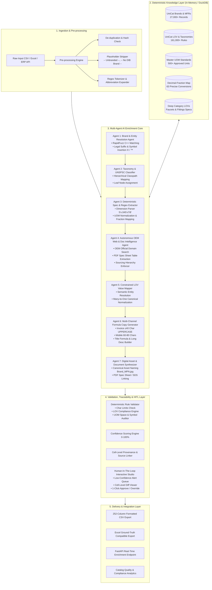
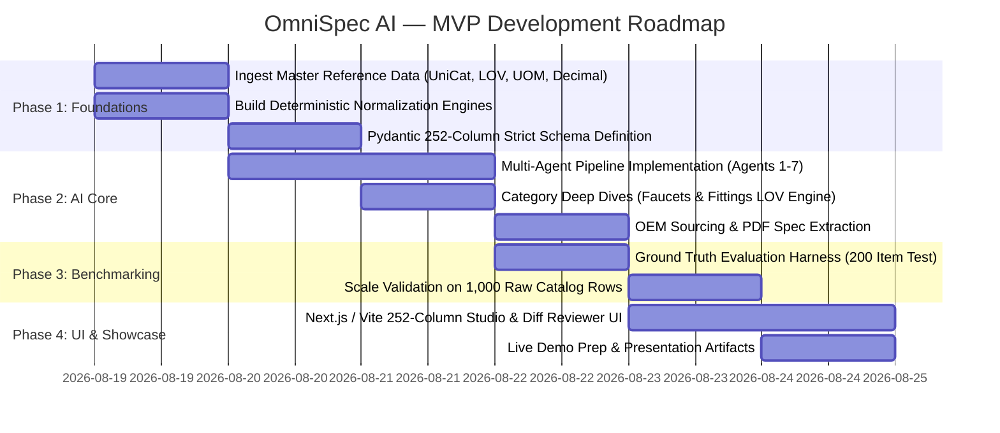

# ⚙️ OmniSpec AI — Industrial Product Intelligence Platform
### *Autonomous Multi-Agent Enrichment Engine for B2B Industrial Commerce*

> **Tagline:** *"From Cryptic Raw Part Rows to 252-Column Commerce-Ready Master Truth."*  
> **Target Domain:** B2B Industrial Distribution, MRO, Electrical, Plumbing, HVAC, Fasteners, Tools & Hardware Catalogs.  
> **Challenge Alignment:** UniHack AI-Powered Product Intelligence for Industrial Commerce (Unilog Master Content Guidelines).

---

## 1. Executive Summary & Project Identity

### 1.1 Project Identity
- **Project Name:** **OmniSpec AI** (Alternate: **CataLyx Industrial**)
- **Tagline:** *From Cryptic Raw Part Rows to 252-Column Commerce-Ready Master Truth.*
- **System Classification:** Autonomous Multi-Agent Knowledge Graph & RAG-Powered Product Master Data Management (PIM/MDM) Enrichment Pipeline.
- **Core Value Proposition:** Converts cryptic, truncated, abbreviated supplier catalog rows (e.g., `49-94-0013 Milw 5"x.045"x7/8" Metal Cut Off Disc`) into fully enriched, strictly compliant 252-column master data records with 100% adherence to controlled vocabularies (LOVs), Master UOM standards, multi-channel formulaic copy, traceable sourcing, and human-in-the-loop review.

```
+----------------------------------------------------------------------------------------------------+
|                                         OMNISPEC AI CORE                                            |
|                                                                                                    |
|   [ Messy Supplier Row ]                 [ AI Multi-Agent Pipeline ]              [ Master Truth ] |
|   • "3/8 CPLG BRS 150#"        ===>      • Deterministic Normalizer    ===>       • 252 Columns    |
|   • "-- Unbranded --"                    • UniCat Entity Resolution               • 100% LOV Match |
|   • Missing UOMs / Specs                 • Constrained LOV Extractor              • 6 Copy Tiers   |
|                                          • OEM Sourcing & Spec RAG                • Full Lineage   |
+----------------------------------------------------------------------------------------------------+
```

---

## 2. In-Depth Problem & Domain Breakdown

### 2.1 The Industrial B2B Catalog Crisis
Industrial distributors receive raw product feeds from thousands of manufacturers and suppliers. This data is chronically plagued by:
1. **Cryptic Abbreviations:** `1nx6-16' Honey Grove Grooved - Trex Enhance Naturals Decking`, `DBD090094101F Diablo 9" - Metal Cut-Off Disc`, `3MABR-7100075678 3M 775L Stikit Film P150`.
2. **Missing Brand & Manufacturer Attribution:** `E1_Brand`, `Unilog_Brand`, `DIB_Brand` containing placeholders like `-- Unbranded --`, `-- No Unilog Brand --`, `-- No DIB Brand --`, or distributor names instead of OEM manufacturers.
3. **Inconsistent Units of Measure (UOM):** Decimals vs. fractions (`0.5` vs `1/2`, `50.25 in` vs `50-1/4 in`), casing errors (`IN`, `inch`, `Inches` vs approved `in`), and missing spaces (`24in` vs `24 in`).
4. **Multi-Channel Copy Requirements:** A single SKU must be written in 5+ distinct formats:
   - **Invoice Desc:** $\le 40$ chars, ALL CAPS (e.g. `DISHWASHER LEG 5 SST 120V 15A 50-1/4IN`).
   - **Mobile Desc:** $60\text{--}80$ chars (e.g. `Rheem Manufacturing FRIGIDAIRE, Dishwasher, Professional Series, PDSH4816AF`).
   - **Product Title / Short Desc:** Strict formula: `Brand® + Series + MPN + Item Type + Key Attributes`.
   - **Long Description:** Complete specification narrative with exact dimension UOMs and additional information.
   - **Retail & Marketing Descriptions:** High-converting consumer copy + bullet points (`ITEM_FEATURES_1` to `20`).
5. **The 252-Column Delivery Schema:** Requires up to 50 structured attribute pairs (`ATTRIBUTE_LABEL 1..50`, `ATTRIBUTE_VALUE 1..50`, `ATTRIBUTE_UOM 1..50`), physical dimensions, standard packaging, UNSPSC codes, warranty terms, and canonical digital asset filenames (`Brand_MPN.jpg`, `Brand_MPN_Specification_Sheet.pdf`).
6. **Hallucination Penalty:** In industrial commerce, an invented dimension or incompatible connection type leads to job-site downtime, costly returns, or physical hazards. Output must strictly conform to List of Values (LOV) dictionaries and OEM ground truth.

---

## 3. The 252-Column Master Delivery Schema Breakdown

The pipeline generates records structured across **10 distinct functional data tiers**:

| Tier | Category | Columns / Fields | Description & Governance Rules |
| :--- | :--- | :--- | :--- |
| **1** | **Sourcing & Lineage** | `MFR URL`, `Ref URL 1` to `5` | Verifiable OEM URLs (manufacturer-first hierarchy; distributor/marketplace sites prohibited). |
| **2** | **Core Identifiers** | `PART_NUMBER`, `Dept`, `Class`, `Fine`, `SKU`, `Mfg_Part_Num`, `Part_Desc`, `MANUFACTURER_PART_NUMBER`, `ALTERNATE_PART_NUMBER` | Internal SKU mappings and cross-reference numbers. |
| **3** | **Brand Master Data** | `MANUFACTURER_NAME`, `BRAND_NAME`, `TRADE_NAME` | Canonical names with exact legal casing and symbols (`FRIGIDAIRE®`, `Whirlpool®`, `Milwaukee®`) matched to UniCat 27K list. |
| **4** | **Taxonomy & Classpath** | `Classpath` | Hierarchical taxonomy string (e.g. `Appliances & Consumer Electronics > Kitchen Appliances > Built-In Dishwashers`). |
| **5** | **Multi-Channel Copy** | `INVOICE_DESC`, `MOBILE_DESC`, `SHORT_DESC`, `LONG_DESC1`, `RETAIL_DESC`, `MARKETING_DESCRIPTION` | Formula-generated descriptions governed by strict character limits, casing, and word order. |
| **6** | **Feature Bullet Points** | `ITEM_FEATURES_1` to `ITEM_FEATURES_20`, `With`, `Standard/Approvals`, `Prop 65`, `Application`, `Includes`, `Product Name` | Extracted product features, certifications (`ASSE 1006\|ENERGY STAR Certified\|UL Listed`), and accessories. |
| **7** | **Dynamic 50-Pair EAV Attributes** | `ATTRIBUTE_LABEL 1..50`, `ATTRIBUTE_VALUE 1..50`, `ATTRIBUTE_UOM 1..50` | 150 columns of structured attributes normalized strictly to UniCat LOV (~161,000 allowed values). |
| **8** | **Commercial & Logistics** | `UPC`, `EAN`, `GTIN`, `UNSPSC`, `Warranty`, `List Price`, `Selling Qty`, `Selling UOM`, `Standard Packaging Information` | Trade codes, standard packaging, warranty specs (`1 Year Manufacturer, 1 Year Labor and Parts`). |
| **9** | **Physical Dimensions** | `LENGTH`, `LENGTH_UOM`, `HEIGHT`, `HEIGHT_UOM`, `WIDTH`, `WIDTH_UOM`, `WEIGHT`, `WEIGHT_UOM`, `VOLUME`, `VOLUME_UOM` | Fraction-normalized dimensions with standardized UOMs (`in`, `lb`, `ft`). |
| **10** | **Digital Assets & Tech Docs** | `Product Image`, `Alternate Image 1..4`, `SDS`, `Specification Sheet`, `Instruction/Installation Manual`, `Line Drawing`, `RoHS`, etc. | Canonical asset naming convention (`<Brand>_<MPN>.<ext>`) and OEM document linkages. |

---

## 4. End-to-End System Architecture



---

## 5. Multi-Agent Swarm Specification

```
+----------------------------------------------------------------------------------------------------+
|                                    MULTI-AGENT SPECIALIZATION                                       |
+--------------------------+----------------------------------------------------+--------------------+
| Agent Name               | Primary Mission                                    | Deterministic Core |
+--------------------------+----------------------------------------------------+--------------------+
| 1. Entity Resolution     | Resolves cryptic MFR/Brand strings to canonical    | RapidFuzz + UniCat |
| 2. Taxonomy Classifier   | Maps SKU to UNSPSC & UniCat Classpath hierarchy    | LOV Leaf Node Tree |
| 3. Spec & UOM Parser     | Extracts technical metrics, converts to fractions  | UOM + Decimal Map  |
| 4. OEM Doc Intelligence  | Fetches OEM spec sheets, parses PDF tables         | Playwright + RAG   |
| 5. Constrained LOV Engine| Normalizes attribute values into controlled vocabs | 161K LOV Matrix    |
| 6. Formula Copy Builder  | Assembles Invoice, Mobile, Short, Long, Features   | Unilog Rule Book   |
| 7. Quality & Audit Agent | Computes confidence score, provenance, alerts HITL | Compliance Suite   |
+--------------------------+----------------------------------------------------+--------------------+
```

### Agent 1: Brand & Entity Resolution Agent
- **Input:** Raw `Part_Manuf`, `E1_Brand`, `Unilog_Brand`, `DIB_Brand`, `Part_Desc`.
- **Logic:**
  1. Filters out placeholder strings (`-- Unbranded --`, `-- No Unilog Brand --`, etc.).
  2. Extracts brand keywords from `Part_Desc` (e.g. `Milw` $\rightarrow$ `Milwaukee®`, `Diablo` $\rightarrow$ `Diablo®`, `3M` $\rightarrow$ `3M™`).
  3. Executes two-stage matching against the **27,000+ UniCat Master List**:
     - *Stage 1:* Exact & Token Sort Fuzzy Match ($\ge 85\%$ threshold via C++ RapidFuzz).
     - *Stage 2:* Semantic Embedding vector lookup for edge cases.
  4. Injects canonical manufacturer, legal entity suffix (`Inc`, `LLC`), and registered trademark symbols (`®`, `™`).

### Agent 2: Taxonomy & Classpath Classifier
- **Input:** Cleaned Brand, MPN, `Part_Desc`, and extracted tokens.
- **Logic:**
  1. Traverses the UniCat Category Tree down to the leaf node (e.g., `Appliances & Consumer Electronics > Kitchen Appliances > Built-In Dishwashers` or `Plumbing > Pipe, Tube & Hose Fittings > Pipe Fittings`).
  2. Assigns matching UNSPSC classification code.
  3. Fetches the required attribute schema and allowed LOV values associated with that classpath.

### Agent 3: Deterministic Spec & Regex Extractor
- **Input:** `Part_Desc` and unformatted text tokens.
- **Logic:**
  1. Applies high-precision regex patterns for industrial dimension tokens:
     - Dimension triplets: `4"x.040"x5/8"`, `5"x.045"x7/8"`, `1x12-12'`.
     - Electrical ratings: `120V`, `15A`, `240 kW-hr`.
     - Acoustic ratings: `47 dBA`, `41 dBA`.
     - Abrasive grit / packaging: `P150`, `P80`, `220 Grit`, `6pc`, `50 Disc/Box`.
  2. **UOM Normalizer:** Converts any unit variant (`inches`, `IN.`, `inch`) into the approved Master UOM (`in`), guaranteeing a single space between number and unit (`24 in`, not `24in`).
  3. **Decimal-to-Fraction Converter:** Intercepts decimal dimensions (e.g. `50.25`) and applies exact 63-entry fractional lookup (`50-1/4 in`).

### Agent 4: Autonomous OEM Web & Doc Intelligence Agent
- **Input:** Manufacturer Name, Brand, MPN.
- **Logic:**
  1. Generates targeted OEM search query: `site:<oem-domain> "<MPN>"` (Strict Sourcing Hierarchy: OEM site $\gt$ Manufacturer Catalog PDF $\gt$ Spec Sheet; strictly excludes marketplaces like Amazon, eBay, Granger, or generic distributor aggregators).
  2. Retrieves and parses official Product Page / Spec Sheet PDF.
  3. Extracts detailed electrical, mounting, sound level, capacity, and certification tables using Document Intelligence / Vision-Language extraction.
  4. Populates `MFR URL`, `Ref URL 1..5`, `Standard/Approvals`, and `Specification Sheet` links.

### Agent 5: Constrained LOV Value Mapper & Knowledge Graph Engine
- **Input:** Raw extracted attributes from Agent 3 & Agent 4.
- **Logic:**
  1. Binds raw values against the **161,000-row UniCat LOV database** and deep category sheets (**Faucets LOV** and **Fittings LOV**).
  2. Executes Many-to-One Normalization (e.g., collapsing 1,472 fitting connection variants into 515 canonical values, 464 material construction strings into 113 approved materials).
  3. Allocates up to 50 structured attribute triples: `[ATTRIBUTE_LABEL i, ATTRIBUTE_VALUE i, ATTRIBUTE_UOM i]`.

### Agent 6: Multi-Channel Formulaic Copy Builder
- **Input:** All resolved attributes, identifiers, and brand data.
- **Formulas & Constraints:**
  - **Invoice Description:** $\le 40$ chars, strictly UPPERCASE, standard abbreviations:  
    `FORMULA: <ITEM_TYPE> <MOUNTING> <KEY_SPEC> <VOLTAGE> <CURRENT> <DIMENSION>`  
    *Example:* `DISHWASHER LEG 5 SST 120V 15A 50-1/4IN`
  - **Mobile Description:** $60\text{--}80$ characters:  
    `FORMULA: <MANUFACTURER_NAME> <BRAND_NAME>, <ITEM_TYPE>, <SERIES>, <MPN>`  
    *Example:* `Rheem Manufacturing FRIGIDAIRE, Dishwasher, Professional Series, PDSH4816AF`
  - **Product Title / Short Description:**  
    `FORMULA: <BRAND_NAME>® <SERIES> <MPN> <PRODUCT_NAME> With <SPECIAL_FEATURE>, <MOUNTING>, <SPEC>, <FINISH>`  
    *Example:* `FRIGIDAIRE® Professional Series PDSH4816AF Dishwasher With CleanBoost™, Leg Mounting, 5-Wash Cycle, Stainless Steel`
  - **Long Description:**  
    `FORMULA: <BRAND_NAME>® <PRODUCT_NAME> With <FEATURE>, <SERIES>, <SPECS_LIST_WITH_UOM>, Additional Information: <EXTRA_SPECS>`
  - **Retail & Marketing Descriptions:** Compelling marketing copy highlighting key USPs.
  - **Item Features 1 to 20:** Atomic, clean bullet points (e.g., `3rd rack with extra wash action`, `41 dBA`).

### Agent 7: Quality Auditor, Confidence Scorer & Lineage Tracer
- **Logic:**
  1. Computes field-level and overall record confidence score ($0\text{--}100\%$).
  2. Runs 12 automated integrity tests:
     - Character length violations ($\text{Invoice} > 40$, $\text{Mobile} \notin [60, 80]$).
     - Missing mandatory UOM space (`24in` error).
     - Unapproved LOV value detection.
     - Brand casing / trademark symbol audit.
  3. Records cell provenance (Source URL, Extraction Method: `Regex` | `OEM PDF RAG` | `LOV Match` | `HITL Overridden`).
  4. Flags low-confidence fields for Human-In-The-Loop review.

---

## 6. Comprehensive Technology Stack

```
+----------------------------------------------------------------------------------------------------+
|                                      COMPLETE TECHNOLOGY STACK                                      |
+---------------------+-----------------------------------+------------------------------------------+
| Layer               | Technology                        | Role / Purpose                           |
+---------------------+-----------------------------------+------------------------------------------+
| Backend Core        | Python 3.11+, FastAPI, Uvicorn    | High-performance async microservices API |
| Data Schema         | Pydantic v2 (Strict Schema)       | 252-column validation & type enforcement |
| Multi-Agent LLM     | LangGraph + Gemini / GPT          | State graph orchestration & tabular reasoning |
| Deterministic Match | RapidFuzz (C++ bindings)          | Sub-millisecond brand & LOV fuzzy search |
| Local In-Memory DB  | DuckDB + SQLite                   | 161K LOV queries & Decimal/UOM lookups   |
| Vector Store        | ChromaDB / FAISS                  | Semantic search for taxonomy & synonyms  |
| Web & Doc Scraping  | Playwright + BeautifulSoup4 + PyMuPDF | Headless OEM scraping & PDF intelligence |
| Frontend Framework  | Next.js 14 / React 18 + Vite      | High-performance responsive web studio   |
| UI / Styling        | TailwindCSS + Glassmorphic CSS    | Premium industrial dark-mode aesthetics  |
| Spreadsheet Engine  | AG Grid Enterprise / TanStack     | 252-column virtualized data grid         |
| State Management    | Zustand + TanStack Query          | Real-time pipeline state & caching       |
| Export & Packaging  | OpenPyXL + Pandas                 | Byte-perfect Excel/CSV 252-col generator |
+---------------------+-----------------------------------+------------------------------------------+
```

---

## 7. Granular Step-by-Step Implementation Roadmap (MVP)



### Phase 1: Master Data Caching & Deterministic Rule Engines
1. **Parser Modules for Master Reference Sets:**
   - Ingest `UniCat_Manufacturer_and_Brand_List` $\rightarrow$ Build indexed DuckDB / RapidFuzz dictionary.
   - Ingest `Unicat_Lov_v1_0` $\rightarrow$ Build Classpath $\rightarrow$ Attribute $\rightarrow$ Allowed Values tree.
   - Ingest `Master_UOM_Standards` $\rightarrow$ Build 500+ UOM translation table.
   - Ingest `Decimal_Fraction` $\rightarrow$ Build 63-entry fraction lookup hashmap.
2. **Pydantic Schema Creation:** Complete typed Python model mapping all 252 columns with regex validators and length constraints.

### Phase 2: Autonomous Multi-Agent Pipeline
1. **Brand Resolution Module:** Strip `-- Unbranded --`, fuzzy match against UniCat, append `®`/`™`.
2. **Regex Spec Parser:** Extract sizes, dimensions, electrical specs, grit, and quantity pack metrics.
3. **Deep Category Handlers:** Specialized logic for high-value categories (e.g. Faucets: spout reach, flow rate, finish; Fittings: connection types, thread sizes, material).
4. **Copy Generation Formulas:** Deterministic templates enforcing length constraints for Invoice ($\le 40$ UPPERCASE), Mobile ($60\text{--}80$ chars), and Title formulas.
5. **Digital Asset Naming:** Canonical `<Brand>_<MPN>.<ext>` synthesizer.

### Phase 3: Evaluation Suite & Benchmark against Ground Truth
1. **Scoring Engine:** Automated evaluator comparing pipeline output against `Unihack_ Expected Output - Delivery Format.csv`:
   - Exact Match % on Key Fields (`MANUFACTURER_NAME`, `BRAND_NAME`, `Classpath`).
   - Character Length Compliance % (`INVOICE_DESC`, `MOBILE_DESC`).
   - UOM Compliance % (Standardized abbreviation & spacing check).
   - Attribute LOV Validity % (% of generated attributes matching canonical LOV).
2. **Scale Testing:** Run pipeline against all 1,000 items in `Unihack_ Sample Dataset - Input.csv`.

### Phase 4: World-Class Interactive Studio & HITL UI
1. **Interactive Virtualized Grid:** AG Grid / TanStack table displaying all 252 enriched columns with sticky key columns (`MPN`, `Brand`, `Title`, `Classpath`).
2. **Confidence Heatmap & Cell Inspection:** Visual green/yellow/red confidence badges on each cell with click-to-view source provenance.
3. **Human-in-the-Loop Diff Reviewer:** Side-by-side comparison of Raw Input vs. AI Generated vs. Edited Output.
4. **Real-time Pipeline Visualizer:** Interactive agent execution trace showing how tokens were extracted, normalized, and mapped.
5. **1-Click Export:** Download delivery-ready CSV and Excel formats.

---

## 8. Hackathon-Winning Edge & Unique Innovations

```
+----------------------------------------------------------------------------------------------------+
|                                    WHY OMNISPEC AI WINS                                             |
+------------------------------------+---------------------------------------------------------------+
| Feature                            | Competitive Advantage                                         |
+------------------------------------+---------------------------------------------------------------+
| 1. Deterministic LOV Guardrails    | Zero hallucination on attributes, UOMs, and Brand symbols     |
| 2. Deep Category Specialization    | Full-depth implementation of Faucets & Fittings LOV specs     |
| 3. Multi-Channel Formula Engine    | 100% compliance with Invoice <=40 & Mobile 60-80 char rules   |
| 4. Traceability & Lineage Matrix   | Every cell linked to OEM source URL or LOV rule               |
| 5. Interactive HITL Web Studio     | Enterprise-ready UI with virtualized 252-column editing grid   |
| 6. Quantitative Ground Truth Score | Live accuracy dashboard scored against 200 ground truth items |
+------------------------------------+---------------------------------------------------------------+
```

---

## 9. Next Steps for Immediate Execution

1. **Initialize Project Repository Structure:**
   - `backend/`: FastAPI application, Agent swarm, Data normalizers, Schema definitions.
   - `frontend/`: Modern Next.js / Vite web application with 252-column virtualized data studio.
   - `data/`: Ingested SQLite/DuckDB databases of UniCat, LOV, UOM, and Decimal tables.
   - `eval/`: Automated scoring suite benchmarking against ground truth datasets.
2. **Run Initial Data Pipeline Verification:**
   - Execute baseline extraction on sample rows (e.g. Frigidaire dishwasher, Milwaukee discs, Trex decking).
   - Verify character limits and LOV adherence.
3. **Launch Web Application Dev Server:**
   - Provide interactive UI for live demonstrations, catalog uploads, and batch enrichment.
