# 📥 Agent 1: Ingestion, De-Noising & Tokenizer Agent
### *OmniSpec AI — Data Cleaning, Placeholder Stripping & Lexical Pre-Processing Engine*

---

## 1. Architectural Blueprint & Component Topology

```mermaid
flowchart TD
    subgraph INGESTION_INPUT ["📥 Raw Input Payload"]
        RAW_MPN["Raw MPN (e.g. 'DCB518ASTS06G')"]
        RAW_DESC["Raw Part Desc (e.g. 'DCB518ASTS06G Diablo 1/2 in x 18 in - Sanding Belt 6pc sawzall')"]
        RAW_BRAND["Brand Placeholders (e.g. '-- Unbranded --', '-- No Unilog Brand --')"]
        RAW_MFR["Supplier String (e.g. 'Freud Inc (2435)')"]
    end

    subgraph AGENT_1_CORE ["⚙️ Agent 1 Lexical Engine (IngestionAgent)"]
        direction TB
        STEP1["1. Placeholder Purge & Sanitization<br/>• Regex Matcher strips negative placeholders<br/>• Unescapes HTML entities & non-breaking spaces"]
        STEP2["2. Supplier Vendor-Code Isolator<br/>• Extracts legal name ('Freud Inc')<br/>• Extracts vendor code ('2435', 'JAMIN', 'BOICA')"]
        STEP3["3. Trade Slang & Contractor Thesaurus<br/>• Queries DuckDB industry_thesaurus<br/>• Resolves 'sawzall' → Reciprocating Saw, 'romex' → Non-Metallic Cable"]
        STEP4["4. Lexical Token Segmenter<br/>• Isolates MPN prefix ('DCB518ASTS06G')<br/>• Isolates brand tokens ('Diablo', 'Freud')<br/>• Isolates dimension blocks ('1/2 in x 18 in')<br/>• Isolates pack count ('6pc')"]
        STEP5["5. Cryptographic Fingerprint<br/>• Computes deterministic SHA-256 row hash for lineage tracking"]
        
        STEP1 --> STEP2 --> STEP3 --> STEP4 --> STEP5
    end

    subgraph ENRICHED_STATE ["📦 State Delta Output (ProductEnrichmentState)"]
        CLEAN_MPN["clean_mfg_part_num: 'DCB518ASTS06G'"]
        CLEAN_DESC["cleaned_part_desc: 'Diablo 1/2 in x 18 in - Sanding Belt 6pc'"]
        CLEAN_MFR["clean_supplier_name: 'Freud Inc', vendor_code: '2435'"]
        TOKENS["brand_candidates: ['Diablo', 'Freud Inc'], dimension_blocks: ['1/2 in x 18 in']"]
        HASH["row_hash: 'd89a55a9...'"]
    end

    INGESTION_INPUT --> STEP1
    STEP5 --> ENRICHED_STATE
```



---

## 2. Input Schema & Data Contract

| Field Name | Type | Presence | Sample Input Value |
| :--- | :--- | :--- | :--- |
| `Mfg_Part_Num` | `string` | Mandatory | `DCB518ASTS06G` |
| `Part_Desc` | `string` | Mandatory | `DCB518ASTS06G Diablo 1/2"x18" - Sanding Belt 6pc` |
| `E1_Brand` | `string` | Optional | `-- Unbranded --` |
| `Unilog_Brand`| `string` | Optional | `-- No Unilog Brand --` |
| `DIB_Brand` | `string` | Optional | `-- No DIB Brand --` |
| `Part_Manuf` | `string` | Optional | `Freud Inc (2435)` |
| `SKU` | `string` | Optional | `1515863` |

---

## 3. Detailed Processing Logic & Algorithms

### Step 1: Placeholder Eradication Engine
The agent checks all brand and text fields against a compiled list of negative placeholders:
```python
NEGATIVE_PLACEHOLDERS = {
    "-- unbranded --", "-- no unilog brand --", "-- no dib brand --",
    "unbranded", "no brand", "generic", "n/a", "none", "unknown", "--"
}
```

### Step 2: Contractor Slang Thesaurus (DuckDB)
Queries the in-memory DuckDB `industry_thesaurus` table:
```sql
SELECT canonical_product_noun, classpath_hint, category_group 
FROM industry_thesaurus 
WHERE LOWER(slang_term) = LOWER(?)
```

| Slang Term | Canonical Product Noun | Category Hint |
| :--- | :--- | :--- |
| `sawzall` | `Reciprocating Saw` | Power Tools |
| `skilsaw` | `Circular Saw` | Power Tools |
| `romex` | `Non-Metallic Sheathed Cable` | Electrical |
| `zipper disc` | `Cut-Off Wheel` | Abrasives |
| `whirlybird` | `Turbine Roof Vent` | HVAC & Ventilation |

---

## 4. Execution Telemetry & Performance
- **Average Latency:** $0.6\text{--}1.5\text{ ms}$ per SKU.
- **Trace Output:** Logs `[Agent 1 ✓] Ingestion Complete (<ms> ms) — MPN: '<clean_mpn>'`.
