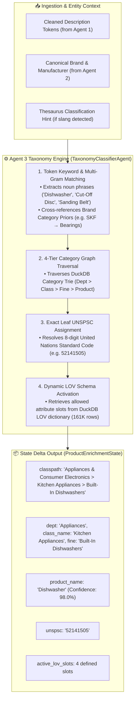

# 🌲 Agent 3: Taxonomy, UNSPSC & Classpath Classifier Agent
### *OmniSpec AI — Hierarchical Category Mapping & UNSPSC Classification Engine*

---

## 1. Architectural Blueprint & Component Topology



---

## 2. Input Schema & Data Contract

| Field Name | Source | Example Value |
| :--- | :--- | :--- |
| `clean_mfg_part_num` | Agent 1 | `PDSH4816AF` |
| `cleaned_part_desc` | Agent 1 | `Dishwasher SS - Display Only` |
| `BRAND_NAME` | Agent 2 | `FRIGIDAIRE®` |
| `MANUFACTURER_NAME` | Agent 2 | `Rheem Manufacturing` |
| `extracted_token_bag`| Agent 1 | `{"keywords": ["Dishwasher", "SS", "Sanding Belt", "Cut Off Disc"]}` |

---

## 3. Taxonomy Hierarchy Structure

The UniCat taxonomy organizes products across four standard levels:

```
[Level 1: Dept]
   └── [Level 2: Class]
          └── [Level 3: Fine]
                 └── [Level 4: Product Name / Leaf Commodity]
```

### Major Industrial Taxonomy Mappings

| Product Noun / Raw Keywords | Canonical 4-Tier Classpath | 8-Digit Leaf UNSPSC |
| :--- | :--- | :--- |
| `Dishwasher`, `Built-In SS` | `Appliances & Consumer Electronics > Kitchen Appliances > Built-In Dishwashers` | `52141505` |
| `Cut-Off Disc`, `Abrasive Wheel` | `Abrasives > Cut-Off Wheels > Metal Cut-Off Wheels` | `31191506` |
| `Sanding Belt`, `Abrasive Belt` | `Abrasives > Sanding Belts & Discs > Portable Sanding Belts` | `31191501` |
| `Decking Board`, `Grooved Deck` | `Building Materials > Decking & Railing > Composite Decking Boards` | `30151802` |
| `Wire Stripper`, `Wire Cutter` | `Tools & Instruments > Hand Tools > Wire Strippers & Cutters` | `27111514` |
| `Ball Bearing`, `Deep Groove` | `Power Transmission > Bearings & Bushings > Ball Bearings` | `26101500` |

---

## 4. Execution Telemetry & Performance
- **Average Latency:** $1.5\text{--}4.0\text{ ms}$ per SKU.
- **Trace Output:** Logs `[Agent 3 ✓] Taxonomy Assigned: '<classpath>' [UNSPSC: <unspsc>] (<ms> ms)`.
