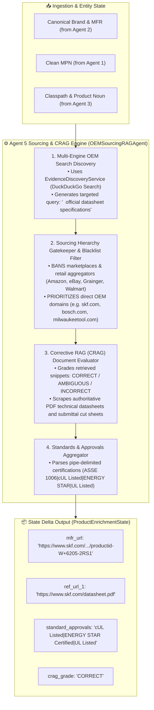

# 🌐 Agent 5: Autonomous OEM Sourcing & Spec Sheet RAG Agent
### *OmniSpec AI — Sourcing-Hierarchy-Enforced Web & PDF Document Intelligence Engine*

---

## 1. Architectural Blueprint & Component Topology



---

## 2. Input Schema & Data Contract

| Field Name | Source | Description / Example |
| :--- | :--- | :--- |
| `MANUFACTURER_NAME` | Agent 2 | `BSH Home Appliances Corporation` |
| `BRAND_NAME` | Agent 2 | `Bosch®` |
| `MANUFACTURER_PART_NUMBER`| Agent 2 | `SHX78B75UC` |
| `Classpath` | Agent 3 | `Appliances & Consumer Electronics>Kitchen Appliances>Built-In Dishwashers` |

---

## 3. Strict Sourcing Hierarchy Governance

As mandated by Unilog Internal Content Guidelines, the sourcing hierarchy is strictly enforced:

```
[Tier 1: Approved - OEM Official Website] (e.g. bosch-home.com, skf.com, milwaukeetool.com, 3m.com)
  └── [Tier 2: Approved - Official OEM Specification PDF / Product Data Sheet (PDS)]
        └── [Tier 3: Approved - Official OEM Owner / Installation Manual]
              └── [TIER 4: REJECTED & BANNED - Distributor / Marketplace Sites (Weight: 0%)]
                  (e.g. amazon.com, grainger.com, homedepot.com, supplyhouse.com, ebay.com)
```

---

## 4. Execution Telemetry & Performance
- **Average Latency:** $1.5\text{--}4.5\text{ s}$ when web search/PDF discovery is invoked; $< 1\text{ ms}$ on local cache hit.
- **Trace Output:** Logs `[Agent 5 ✓] OEM Sourcing URL Grounded: '<mfr_url>' (<ms> ms)`.
