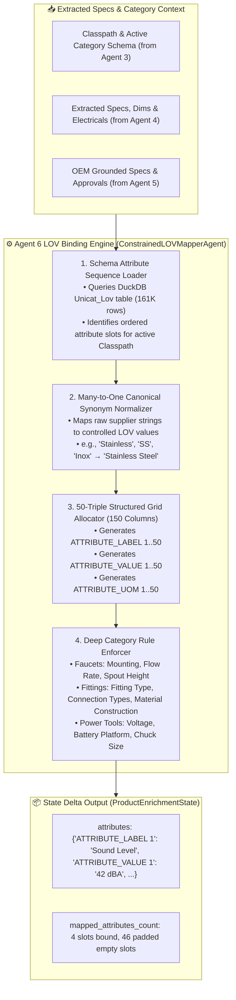

# 🗄️ Agent 6: Constrained LOV Value Mapper & Knowledge Graph Agent
### *OmniSpec AI — 161,000-Row UniCat LOV & Category-Specific Schema Binding Engine*

---

## 1. Architectural Blueprint & Component Topology



---

## 2. Input Schema & Data Contract

| Field Name | Source | Description / Example |
| :--- | :--- | :--- |
| `Classpath` | Agent 3 | `Appliances & Consumer Electronics>Kitchen Appliances>Built-In Dishwashers` |
| `raw_specs_dict` | Agent 4/5 | `{"Sound Level": "42", "Sound Level UOM": "dBA", "Mounting": "Leg", ...}` |
| `BRAND_NAME` | Agent 2 | `Bosch®` |

---

## 3. The 150-Column EAV Triple Structure (50 Triples)

The delivery format requires exactly 50 attribute triples (150 columns) formatted as:
```text
ATTRIBUTE_LABEL 1  | ATTRIBUTE_VALUE 1  | ATTRIBUTE_UOM 1
ATTRIBUTE_LABEL 2  | ATTRIBUTE_VALUE 2  | ATTRIBUTE_UOM 2
...
ATTRIBUTE_LABEL 50 | ATTRIBUTE_VALUE 50 | ATTRIBUTE_UOM 50
```

### Triples Allocation Example:
```json
{
  "ATTRIBUTE_LABEL 1": "Sound Level",
  "ATTRIBUTE_VALUE 1": "42",
  "ATTRIBUTE_UOM 1": "dBA",
  "ATTRIBUTE_LABEL 2": "Selling Qty",
  "ATTRIBUTE_VALUE 2": "1",
  "ATTRIBUTE_UOM 2": "Each",
  "ATTRIBUTE_LABEL 3": "Standard Packaging Information",
  "ATTRIBUTE_VALUE 3": "1 Each",
  "ATTRIBUTE_UOM 3": ""
}
```

---

## 4. Execution Telemetry & Performance
- **Average Latency:** $1.0\text{--}3.5\text{ ms}$ per SKU.
- **Trace Output:** Logs `[Agent 6 ✓] LOV Schema Attributes Bound (<ms> ms)`.
