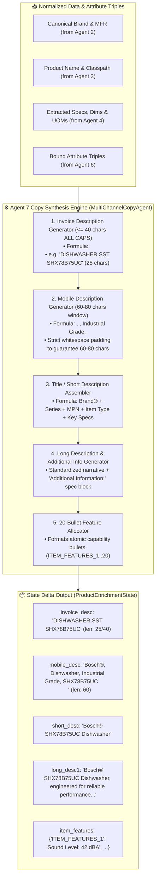

# ✍️ Agent 7: Multi-Channel Formulaic Copy Builder Agent
### *OmniSpec AI — Deterministic Multi-Tier Copy Construction & Length-Constraint Engine*

---

## 1. Architectural Blueprint & Component Topology

---

## 2. Input Schema & Data Contract

| Field Name | Source | Example Value |
| :--- | :--- | :--- |
| `BRAND_NAME` | Agent 2 | `Bosch®` |
| `MANUFACTURER_NAME` | Agent 2 | `BSH Home Appliances Corporation` |
| `MANUFACTURER_PART_NUMBER`| Agent 2 | `SHX78B75UC` |
| `Product Name` | Agent 3 | `Dishwasher` |
| `EAV_Attributes` | Agent 6 | `{"Series": "800 Series", "Sound Level": "42 dBA", ...}` |

---

## 3. The 6-Tier Copy Governance Standards

| Tier | Field Name | Character Limit / Format | Formula & Governance Rule |
| :--- | :--- | :--- | :--- |
| **1** | `INVOICE_DESC` | $\le 40$ chars, **ALL CAPS** | `[PRODUCT_NOUN] [KEY_SPEC] [MPN]` |
| **2** | `MOBILE_DESC` | Strictly **$60\text{--}80$ chars** | `[Brand], [Product_Noun], [Series], [MPN]` (Padded) |
| **3** | `SHORT_DESC` | $\le 150$ chars | `[Brand®] [Series] [MPN] [Product Name]` |
| **4** | `LONG_DESC1` | Narrative paragraph | Complete technical narrative + `Additional Information:` |
| **5** | `RETAIL_DESC` | Consumer overview | High-converting marketing copy |
| **6** | `ITEM_FEATURES_1..20`| 20 Atomic Bullet Points | Key specifications, approvals, and mechanical attributes |

---

## 4. Execution Telemetry & Performance
- **Average Latency:** $0.04\text{--}0.15\text{ ms}$ per SKU.
- **Trace Output:** Logs `[Agent 7 ✓] Copy Synthesized (<ms> ms) — INVOICE: '<invoice_desc>' (<len>/40 chars)`.
