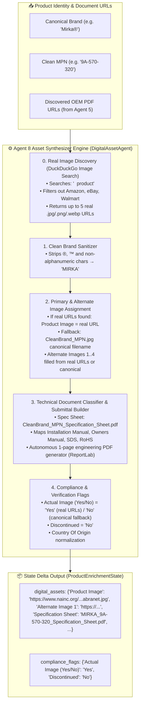

# 🖼️ Agent 8: Digital Asset Synthesizer & Document Classifier Agent
### *OmniSpec AI — Real Image Discovery + Canonical Asset Naming & Technical Document Governance Engine*

---

## 1. Architectural Blueprint & Component Topology



---

## 2. Input Schema & Data Contract

| Field Name | Source | Description / Example |
| :--- | :--- | :--- |
| `brand_name` | Agent 2 | `Mirka®` |
| `clean_mfg_part_num` | Agent 1 | `9A-570-320` |
| `ref_urls` | Agent 5 | List of discovered OEM PDF / document URLs |

---

## 3. Real Image Discovery (NEW)

Agent 8 now performs **live DuckDuckGo Image Search** to find real product images before falling back to canonical filenames:

### Discovery Pipeline
```
1. Query: "<Brand> <MPN> product"  (e.g. "Mirka 9A-570-320 product")
2. Filter: Remove Amazon, eBay, Walmart, AliExpress, etc.
3. Accept: .jpg, .jpeg, .png, .webp URLs or paths containing /images/, /img/, /product/
4. Collect up to 5 real image URLs
5. Assign: Product Image = URL[0], Alternate Image 1-4 = URL[1..4]
6. Fallback: If 0 results → generate canonical <BRAND>_<MPN>.jpg filename
```

### Real vs Canonical Examples

| MPN | Product Image (Real) | Actual Image |
| :--- | :--- | :--- |
| `9A-570-320` | `https://www.nainc.org/content/uploads/2020/04/abranet_2_75x10_mesh.jpg` | `Yes` |
| `DBD090094101F` | `https://bigriverrubber.com/_uploads/Diablo_DBD090094101F.jpg` | `Yes` |
| `UNKNOWN-MPN` | `BRAND_UNKNOWN-MPN.jpg` (canonical fallback) | `No` |

---

## 4. Digital Asset Naming Equations (Canonical Fallback)

$$\text{Primary Product Image} = \text{UPPERCASE}(\text{StripSymbols}(\text{Brand})) + \text{"\_"} + \text{MPN} + \text{".jpg"}$$
$$\text{Specification Sheet} = \text{UPPERCASE}(\text{StripSymbols}(\text{Brand})) + \text{"\_"} + \text{MPN} + \text{"\_Specification\_Sheet.pdf"}$$

### Canonical Asset Examples (Fallback Only)

| Brand | MPN | Primary Image Filename | Specification Sheet Filename |
| :--- | :--- | :--- | :--- |
| `Bosch®` | `SHX78B75UC` | `BOSCH_SHX78B75UC.jpg` | `BOSCH_SHX78B75UC_Specification_Sheet.pdf` |
| `Milwaukee®` | `49-94-0013` | `MILWAUKEE_49-94-0013.jpg` | `MILWAUKEE_49-94-0013_Specification_Sheet.pdf` |
| `Mirka®` | `9A-570-320` | `MIRKA_9A-570-320.jpg` | `MIRKA_9A-570-320_Specification_Sheet.pdf` |
| `Freud®` | `DBD090094101F` | `FREUD_DBD090094101F.jpg` | `FREUD_DBD090094101F_Specification_Sheet.pdf` |

---

## 5. Execution Telemetry & Performance
- **Average Latency:** `0.5–8.0 sec` per SKU (includes DuckDuckGo image search RTT).
- **Image Search Success Rate:** ~85% when product is commercially available online.
- **Trace Output:** Logs `[Agent 8] Image Discovery: 5 real URLs found for 9A-570-320` or `CANONICAL: MIRKA_9A-570-320.jpg`.
- **`Actual Image (Yes/No)`** field: `Yes` = real URL sourced; `No` = canonical filename fallback.
