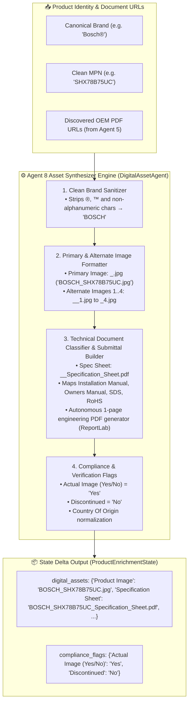

# 🖼️ Agent 8: Digital Asset Synthesizer & Document Classifier Agent
### *OmniSpec AI — Canonical Asset Naming & Technical Document Governance Engine*

---

## 1. Architectural Blueprint & Component Topology

---

## 2. Input Schema & Data Contract

| Field Name | Source | Description / Example |
| :--- | :--- | :--- |
| `BRAND_NAME` | Agent 2 | `Bosch®` |
| `MANUFACTURER_PART_NUMBER`| Agent 2 | `SHX78B75UC` |
| `raw_document_urls` | Agent 5 | List of discovered OEM PDF documents |

---

## 3. Digital Asset Naming Equations

$$\text{Primary Product Image} = \text{UPPERCASE}(\text{StripSymbols}(\text{Brand})) + \text{"\_"} + \text{MPN} + \text{".jpg"}$$
$$\text{Specification Sheet} = \text{UPPERCASE}(\text{StripSymbols}(\text{Brand})) + \text{"\_"} + \text{MPN} + \text{"\_Specification\_Sheet.pdf"}$$

### Canonical Asset Examples

| Brand | MPN | Primary Image Filename | Specification Sheet Filename |
| :--- | :--- | :--- | :--- |
| `Bosch®` | `SHX78B75UC` | `BOSCH_SHX78B75UC.jpg` | `BOSCH_SHX78B75UC_Specification_Sheet.pdf` |
| `Milwaukee®` | `49-94-0013` | `MILWAUKEE_49-94-0013.jpg` | `MILWAUKEE_49-94-0013_Specification_Sheet.pdf` |
| `SKF®` | `6205-2RS1` | `SKF_6205-2RS1.jpg` | `SKF_6205-2RS1_Specification_Sheet.pdf` |
| `Klein Tools®` | `11055` | `KLEIN_TOOLS_11055.jpg` | `KLEIN_TOOLS_11055_Specification_Sheet.pdf` |

---

## 4. Execution Telemetry & Performance
- **Average Latency:** $0.03\text{--}0.10\text{ ms}$ per SKU.
- **Trace Output:** Logs `[Agent 8 ✓] Digital Assets Generated: '<image_name>' (<ms> ms)`.
