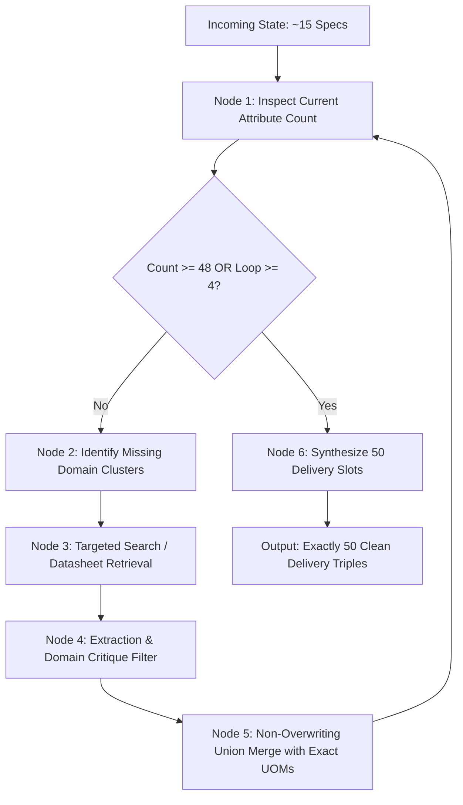

# 🧠 Agent 9: ReAct Attribute Finalizer & Multi-Loop Subgraph

> **Agent Number:** 9 of 10  
> **Module Path:** [`backend/app/orchestrator/attribute_finalizer_orchestrator.py`](file:///c:/Users/yx084/OneDrive/UniHack/backend/app/orchestrator/attribute_finalizer_orchestrator.py)  
> **Role:** Closed-Loop Autonomous Multi-Loop ReAct Orchestrator for 50 Attribute Triples  
> **Key Technologies:** LangGraph Subgraphs, LangChain ReAct Tools, DuckDB Category Schemas, Physical UOM Standards

---

## 🎯 Primary Mission

Agent 9 solves the industrial catalog density challenge. While raw feeds provide only 1 to 5 basic specs, industrial e-commerce platforms require up to **50 verified attribute triples** (`ATTRIBUTE_LABEL 1..50`, `ATTRIBUTE_VALUE 1..50`, `ATTRIBUTE_UOM 1..50`) spanning:
1. **Geometry & Dimensions**: Diameter, Length, Width, Thickness, Arbor Size.
2. **Material, Grain & Backing**: Abrasive Material, Grain Structure, Backing Weight, Bonding Agent, Coating Structure.
3. **Mount & Tool Interface**: Disc/Belt Type, Attachment Mount, Hole Pattern, Compatible Tools.
4. **Performance & Speed**: Max RPM, Max Surface Speed (SFPM), Cutting Action, Wet/Dry Compatibility, Anti-Clog.
5. **Workpiece & Substrate Compatibility**: Primary/Secondary Substrates, Material Application, Target Finish.
6. **Commercial, Packaging & Compliance**: Standard Packaging, Quantity, Country of Origin, ANSI/ISO Standards, Prop 65.

---

## 🏗️ Closed-Loop ReAct Subgraph Flow

---

## 🔬 Core Innovations

1. **Autonomous 5-Loop Convergence**: Iteratively queries missing technical clusters until reaching target density ($\ge 48\text{--}50$ verified triples).
2. **Domain Critique & Geometry Gate**: Automatically filters out incompatible attributes (e.g., forbids `Arbor Size` on linear rolls/strips/belts; forbids electrical amperage on passive abrasives).
3. **Physical Law & ANSI B7.1 Standards**: Computes safe operating speeds based on physical diameter ($9\text{ in} \rightarrow 6,650\text{ rpm}$).
4. **Zero Orphan Labels**: Enforces that every populated `ATTRIBUTE_LABEL` has a non-empty `ATTRIBUTE_VALUE`, and slots $K+1..50$ are strictly blank.
